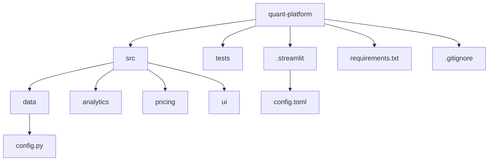
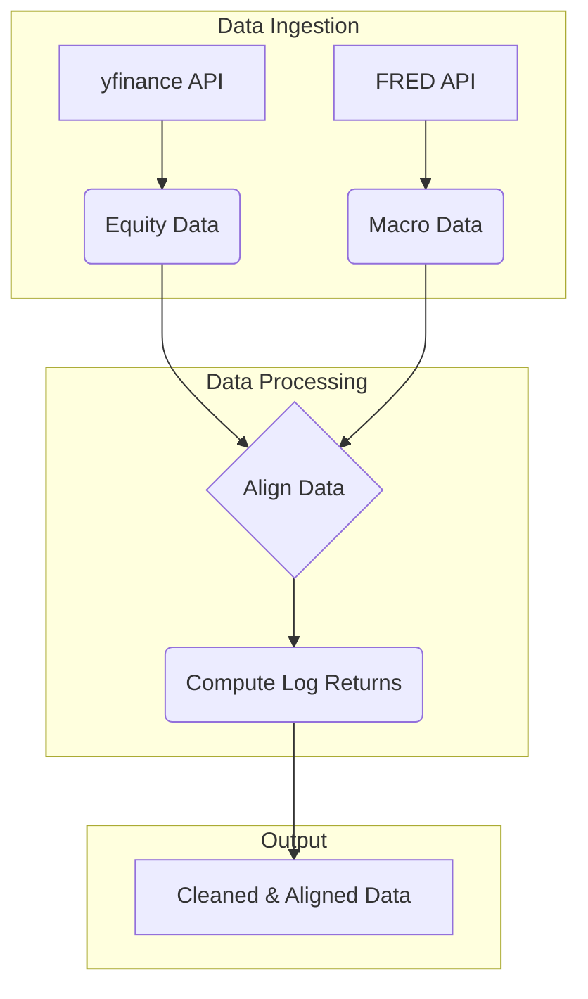

# Automated Quantitative Trading Architecture

## 🚀 Overview

This repository contains a production-grade Quantitative Finance platform built in Python. The platform is designed for portfolio risk analytics, regression and classification modeling, GARCH volatility analysis, derivatives pricing, and delta-neutral hedging strategies. The user interface is an interactive dashboard built with Streamlit.

The project is being developed following a comprehensive 14-day build plan, with a focus on creating a robust and modular system.

## 📊 Project Status

This project is currently in active development. We have completed **4 out of 14 days** of the build plan.

## 🗓️ Day-wise Progress

Here's a summary of the work completed so far:

### Day 1: Project Scaffolding & Data Configuration

The first day was dedicated to setting up the foundational structure of the project. This involved creating the directory layout, defining dependencies, and configuring the application settings. A well-organized structure is crucial for maintainability and scalability.

**Key Achievements:**
-   **Modular Directory Structure:** The project is organized into distinct modules for data, analytics, pricing, and UI, promoting a clean separation of concerns.
-   **Centralized Configuration:** All important parameters like stock tickers, macroeconomic series IDs, portfolio weights, and date ranges are centralized in `src/data/config.py`, making them easy to manage and modify.
-   **Dependency Management:** All required Python packages are listed in `requirements.txt`, ensuring a reproducible environment.
-   **Version Control:** A `.gitignore` file is configured to exclude unnecessary files, keeping the repository clean.
-   **Application Theme:** The Streamlit application is configured with a dark theme for a modern and visually appealing user interface.

**Project Structure Diagram:**



### Day 2: Data Loaders & Macro Alignment

On the second day, we focused on building the data ingestion pipeline. This is a critical component that fetches raw data from external sources and prepares it for analysis.

**Key Achievements:**
-   **Equity Data Loader:** An efficient data loader was implemented to fetch historical stock prices from Yahoo Finance. It includes features like exponential backoff for retries to handle network issues.
-   **Macroeconomic Data Loader:** A loader for fetching macroeconomic data from the Federal Reserve Economic Data (FRED) was created. It is designed with graceful degradation, meaning the application can still function without a FRED API key, albeit with reduced features.
-   **Data Alignment:** A sophisticated data alignment mechanism was developed to merge equity and macroeconomic data. It uses a backward-looking `merge_asof` to prevent look-ahead bias, a common pitfall in financial analysis.
-   **Log Returns Calculation:** A function to compute logarithmic returns was added. Log returns are widely used in quantitative finance for their desirable statistical properties.

**Data Flow Diagram:**



### Day 3: Portfolio Risk Metrics

The third day was focused on implementing the core portfolio risk analytics. This module provides a comprehensive view of the risk profile of a given investment portfolio.

**Key Achievements:**
-   **Weighted Returns:** A function to calculate the weighted returns of a portfolio based on the weights of its individual assets.
-   **Risk Metrics Implementation:** We implemented a suite of industry-standard risk metrics:
    -   **Sharpe Ratio:** Measures the risk-adjusted return of a portfolio.
    -   **Sortino Ratio:** A variation of the Sharpe ratio that only considers downside volatility.
    -   **CAPM Alpha and Beta:** Measures the performance of a portfolio relative to a benchmark index.
    -   **Value at Risk (VaR):** Estimates the potential loss of a portfolio over a specific time horizon and confidence level. Both parametric and historical methods are implemented.
    -   **Conditional Value at Risk (CVaR):** Also known as Expected Shortfall, it measures the expected loss beyond the VaR threshold.
    -   **Maximum Drawdown:** Measures the largest peak-to-trough decline in the value of a portfolio.

### Day 4: Portfolio Tests & Cumulative Returns

On the fourth day, we solidified the portfolio analytics module by adding a comprehensive suite of unit tests. This is a crucial step to ensure the accuracy, reliability, and robustness of the calculated risk metrics.

**Key Achievements:**
-   **Test Suite Creation:** A dedicated test file `tests/test_portfolio.py` was created to house all the unit tests for the portfolio analytics module.
-   **Comprehensive Test Coverage:** We implemented tests for all the risk metrics, covering various scenarios and edge cases.
-   **Edge Case Handling:** The tests include checks for specific edge cases, such as the handling of zero standard deviation in the Sharpe Ratio calculation, to prevent unexpected behavior.
-   **Validation Against Known Values:** The tests are designed to validate the output of the functions against known and expected results, ensuring the correctness of the implemented algorithms.

**Example Test Case:**
```python
def test_sharpe_ratio_known():
    # Daily returns = constant 0.001 (annualized ~25.2%), rf=0.0, std = 0
    # Should return np.nan (std < 1e-8)
    returns = pd.Series([0.001] * 252)
    risk_free_rate = 0.0
    sharpe = sharpe_ratio(returns, risk_free_rate)
    assert np.isnan(sharpe)
```

## 🛠️ Setup and Usage

To get started with the project, follow these steps:

1.  **Activate Conda Environment:**
    ```bash
    conda activate ./quant
    ```

2.  **Install Dependencies:**
    ```bash
    pip install -r requirements.txt
    ```

3.  **Run Tests:**
    ```bash
    pytest tests/ -v
    ```

4.  **Run the Streamlit App:**
    ```bash
    streamlit run src/ui/app.py
    ```

## 🚀 Future Work

The project will continue to be developed following the 14-day plan. Here are the upcoming tasks:

-   **Day 5:** AAPL Regression with Diagnostics
-   **Day 6:** BAC ML Classification
-   **Day 7:** GARCH Volatility Modeling
-   **Day 8:** Volatility Tests + ARCH LM Test
-   **Day 9:** Black-Scholes + Greeks
-   And more...

Stay tuned for more updates!
