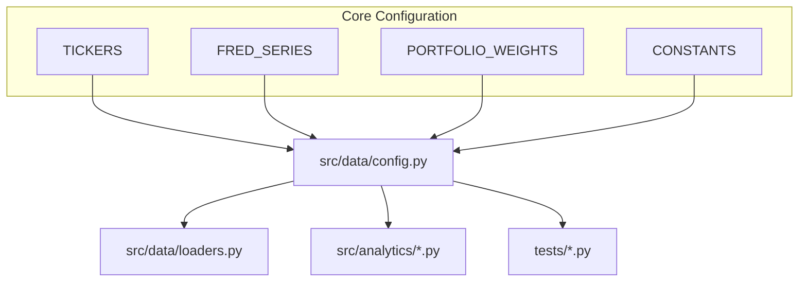
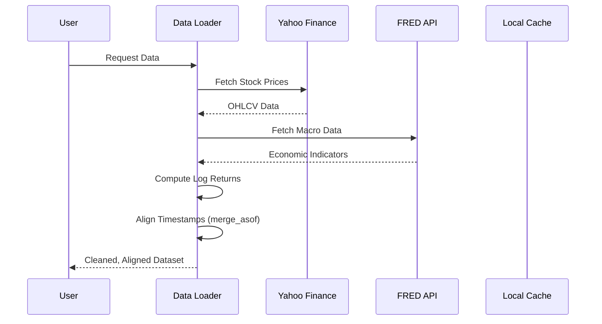
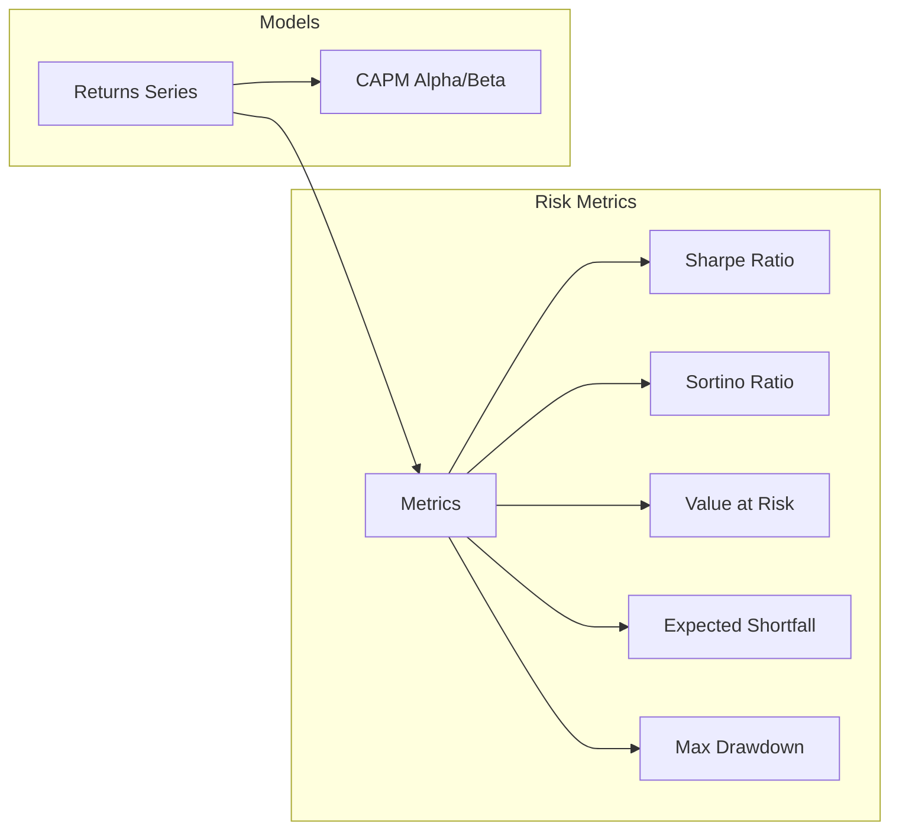

# Automated Quantitative Trading Architecture

## 🚀 Overview

This repository contains a production-grade Quantitative Finance platform built in Python. The platform is designed for portfolio risk analytics, regression and classification modeling, GARCH volatility analysis, derivatives pricing, and delta-neutral hedging strategies. The user interface is an interactive dashboard built with Streamlit.

The project is being developed following a comprehensive 14-day build plan, with a focus on creating a robust and modular system.

## 📊 Project Status

This project is currently in active development. We have completed **4 out of 14 days** of the build plan.

## 🗓️ Day-wise Progress

Here's a summary of the work completed so far:

### Day 1: Project Scaffolding & Configuration

**Goal:** Establish the project structure, development environment, and centralized configuration.

#### 1. Project Structure
We adopted a modular directory structure to separate concerns:
- `src/data`: Data ingestion and processing.
- `src/analytics`: Core financial calculations and risk metrics.
- `src/pricing`: Derivatives pricing models (planned).
- `src/ui`: Streamlit dashboard components (planned).
- `tests`: Unit tests mirroring the source structure.

#### 2. Centralized Configuration (`src/data/config.py`)
A single source of truth for all project constants was created. This ensures consistency and easy tuning of parameters.

**Key Code Snippet:**
```python
# src/data/config.py

# Asset Definitions
TICKERS = {
    "banking": ["MS", "JPM", "BAC"],
    "tech": ["AAPL"],
    "market": ["^GSPC", "^IXIC"],
}

# Macroeconomic Series (FRED IDs)
FRED_SERIES = {
    "DGS10": "10Y Treasury",
    "T10Y2Y": "Yield Curve",
    "VIXCLS": "VIX",
    # ...
}

# Portfolio Configuration
PORTFOLIO_WEIGHTS = {"MS": 0.33, "JPM": 0.34, "BAC": 0.33}

# Constants
TRADING_DAYS = 252
VAR_CONFIDENCE = 0.95
```

#### 3. Architecture Diagram


### Day 2: Data Ingestion & Alignment

**Goal:** Build robust data loaders for Equity (Yahoo Finance) and Macro (FRED) data, and align them without look-ahead bias.

#### 1. Robust Data Fetching
We implemented retry logic with exponential backoff for network resilience and graceful degradation if the FRED API key is missing.

**Code Snippet: Equity Loader**
```python
# src/data/loaders.py

def fetch_equity(tickers, start, end):
    for attempt in range(MAX_RETRIES):
        try:
            df = yf.download(tickers, start=start, end=end, ...)
            break
        except Exception:
            time.sleep(2**attempt)
    # ... validation and cleaning ...
    return df
```

#### 2. Time-Series Alignment
To combine daily stock prices with potentially lower-frequency macro data (like GDP or CPI), we used `pd.merge_asof` with `direction='backward'`. This is crucial to avoid **look-ahead bias**—we only use macro data that was available *before* or *on* the trading day.

**Code Snippet: Alignment**
```python
# src/data/loaders.py

def align_data(equity_df, macro_df):
    return pd.merge_asof(
        equity_df,
        macro_df,
        on="date",
        direction="backward",  # Critical for preventing look-ahead bias
        tolerance=pd.Timedelta("90d")
    )
```

#### 3. Data Flow Diagram


### Day 3: Portfolio Risk Analytics

**Goal:** Implement industry-standard risk metrics to evaluate portfolio performance.

#### 1. Core Metrics
We implemented a comprehensive suite of risk metrics in `src/analytics/portfolio.py`.

- **Sharpe Ratio**: Excess return per unit of total risk.
- **Sortino Ratio**: Excess return per unit of downside risk.
- **CAPM**: Alpha and Beta against the market.
- **VaR (Value at Risk)**: Parametric and Historical.
- **CVaR (Conditional VaR)**: Expected loss beyond VaR.
- **Maximum Drawdown**: Worst peak-to-trough decline.

**Code Snippet: Sharpe Ratio**
```python
# src/analytics/portfolio.py

def sharpe_ratio(returns, risk_free_rate, periods=252):
    excess = returns - (risk_free_rate / periods)
    std = excess.std(ddof=1)
    if std < 1e-8: return np.nan
    return (excess.mean() * periods) / (std * np.sqrt(periods))
```

**Code Snippet: Parametric VaR**
```python
# src/analytics/portfolio.py

def var_parametric(returns, confidence=0.95):
    z = norm.ppf(1 - confidence)
    return returns.mean() + z * returns.std(ddof=1)
```

#### 2. Analytics Logic Flow


### Day 4: Testing & Verification

**Goal:** Ensure correctness of financial calculations using strictly defined implementation tests.

#### 1. Unit Testing Strategy
We used `pytest` to validate the logic. Key focus areas included:
- **Edge Cases**: Zero volatility, empty data, single-observation series.
- **Correctness**: Comparing output against known theoretical values (e.g., VaR of a normal distribution).
- **Sanity Checks**: Ensuring CVaR is always worse (lower) than VaR.

**Code Snippet: Test Case**
```python
# tests/test_portfolio.py

def test_cvar_worse_than_var():
    """CVaR should always be <= VaR (more negative loss)."""
    returns = np.random.normal(0, 0.02, 5000)
    vh = var_historical(returns, confidence=0.95)
    cv = cvar(returns, confidence=0.95)
    assert cv <= vh
```

## 🛠️ Setup and Usage

To get started with the project, follow these steps:

1.  **Activate Conda Environment:**
    ```bash
    conda activate ./quant
    ```

2.  **Install Dependencies:**
    ```bash
    pip install -r requirements.txt
    ```

3.  **Run Tests:**
    ```bash
    pytest tests/ -v
    ```

4.  **Run the Streamlit App:**
    ```bash
    streamlit run src/ui/app.py
    ```

## 🚀 Future Work

The project will continue to be developed following the 14-day plan. Here are the upcoming tasks:

-   **Day 5:** AAPL Regression with Diagnostics
-   **Day 6:** BAC ML Classification
-   **Day 7:** GARCH Volatility Modeling
-   **Day 8:** Volatility Tests + ARCH LM Test
-   **Day 9:** Black-Scholes + Greeks
-   And more...

Stay tuned for more updates!
