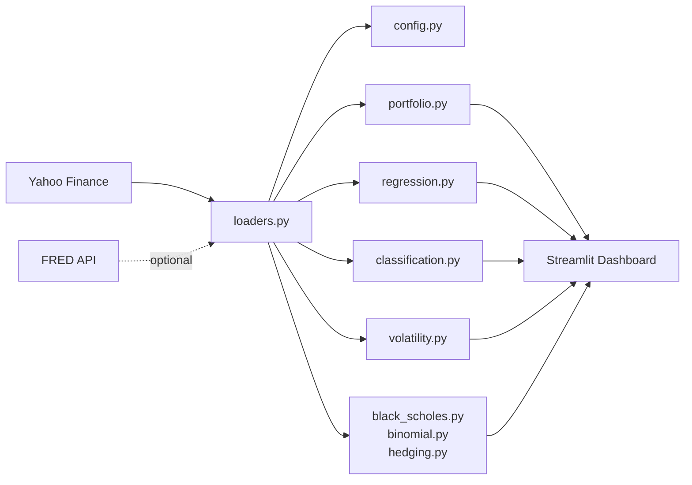

# Quantitative Finance Analytics Platform

A production-grade quantitative finance platform built in Python covering portfolio risk analytics, OLS regression with diagnostics, ML classification, GARCH volatility modeling, Black-Scholes and binomial tree derivatives pricing, and delta-neutral hedging simulation — all accessible through an interactive 4-tab Streamlit dashboard.

---

## Results

> Generated from real market data (2015-01-01 to 2024-12-31) by [`scripts/generate_metrics.py`](scripts/generate_metrics.py).
> Full JSON report: [`results/metrics_report.json`](results/metrics_report.json)

### Portfolio Performance (MS + JPM + BAC, Equal Weight)

| Metric | Portfolio | S&P 500 Benchmark |
|--------|-----------|-------------------|
| Annualized Return | 13.95% | 10.57% |
| Annualized Volatility | 28.35% | 17.89% |
| Sharpe Ratio | 0.42 | 0.48 |
| Sortino Ratio | 0.42 | — |
| Max Drawdown | -50.83% | -36.10% |
| Cumulative Return (10yr) | **+169.1%** | +144.3% |
| CAPM Beta | 1.22 | 1.00 |
| CAPM Alpha (annualized) | +1.09% | — |
| Information Ratio | 0.18 | — |
| Tracking Error | 18.57% | — |

### AAPL Regression (OLS with 5 Features)

| Metric | OLS Model | Naive Baseline |
|--------|-----------|----------------|
| RMSE | 0.01351 | 0.01837 |
| MAE | 0.01013 | 0.01409 |
| **Improvement** | **26.4%** lower RMSE | — |

Diagnostics: 1/4 passed (no autocorrelation confirmed via Durbin-Watson). Heteroscedasticity detected — model uses HC3 robust standard errors.

### BAC Direction Classification (5 Models)

| Model | Accuracy | Precision | Recall | F1 | AUC-ROC |
|-------|----------|-----------|--------|-----|---------|
| Decision Tree | 47.9% | 46.2% | 31.6% | 37.5% | 0.489 |
| Random Forest | 50.7% | 50.2% | 50.6% | 50.4% | 0.519 |
| **KNN** | **52.3%** | **51.6%** | **58.7%** | **54.9%** | **0.539** |
| SVM | 47.3% | 46.9% | 49.0% | 47.9% | 0.510 |
| Voting Ensemble | 52.3% | 51.6% | 58.3% | 54.8% | 0.542 |

- Best single model: KNN (F1 = 54.9%, +4.6% accuracy over random baseline)
- Ensemble AUC-ROC: 0.542
- 19 features engineered, MI-filtered to 8 (42% retention)
- Training data: 1,996 samples (983 down, 1,013 up — balanced)

### Infrastructure

| Metric | Value |
|--------|-------|
| Source code | 2,479 lines across 14 modules |
| Test code | 1,504 lines across 7 files |
| Scripts | 469 lines |
| **Total** | **4,452 lines** |
| Tests | 171 (100% pass rate) |
| Models trained | 6 (OLS + DT + RF + KNN + SVM + Voting Ensemble) |
| Data processed | 2,515 trading days (2015–2024), 6 tickers |

---

## Architecture

```
quant-platform/
├── src/
│   ├── data/                          # Layer 1: Data Ingestion
│   │   ├── config.py                    37 lines — tickers, FRED IDs, weights, constants
│   │   └── loaders.py                  231 lines — yfinance, FRED, merge_asof, get_all_data()
│   │
│   ├── analytics/                     # Layer 2: Statistical Analysis
│   │   ├── portfolio.py                169 lines — Sharpe, Sortino, CAPM, VaR, CVaR, drawdown
│   │   ├── regression.py               197 lines — OLS, VIF, Breusch-Pagan, Durbin-Watson, JB
│   │   ├── classification.py           421 lines — DT, RF, KNN, SVM, Voting, MI selection
│   │   └── volatility.py              200 lines — GARCH(1,1), EWMA, ARCH LM, forecast, cones
│   │
│   ├── pricing/                       # Layer 3: Derivatives Pricing
│   │   ├── black_scholes.py            184 lines — BS pricing, Greeks, IV solver, vol surface
│   │   ├── binomial.py                 160 lines — CRR tree, European/American, Greeks
│   │   └── hedging.py                  189 lines — Delta-neutral sim, summary, band search
│   │
│   └── ui/                            # Layer 4: Streamlit Dashboard
│       ├── app.py                       85 lines — entry point, sidebar, 4 tabs, error isolation
│       ├── tab_portfolio.py             98 lines — risk metrics, VaR, cumul returns, correlation
│       ├── tab_prediction.py           182 lines — AAPL regression + BAC classification charts
│       ├── tab_derivatives.py          165 lines — BS/CRR pricer, Greeks, 3D surface
│       └── tab_hedging.py              161 lines — hedging sim, P&L charts, band optimization
│
├── tests/                             # 171 tests, 100% pass rate
│   ├── test_data.py                     3 tests — loaders, log returns, alignment
│   ├── test_portfolio.py               13 tests — Sharpe, Sortino, VaR, CVaR, CAPM, drawdown
│   ├── test_regression.py              16 tests — features, OLS, diagnostics, evaluation
│   ├── test_classification.py          38 tests — indicators, training, tuning, ensemble, MI
│   ├── test_pricing.py                 47 tests — BS Hull validation, Greeks, IV, CRR, American
│   ├── test_volatility.py              34 tests — ARCH LM, GARCH, EWMA, forecast, cones
│   └── test_hedging.py                 20 tests — simulation, delta, costs, bands, summary
│
├── scripts/
│   └── generate_metrics.py            469 lines — resume metrics + baseline comparisons
│
├── results/
│   └── metrics_report.json            Full JSON report (committed to repo)
│
├── docs/
│   ├── user_guide.md                  Complete user guide with tab-by-tab walkthrough
│   ├── day9_black_scholes.md          Black-Scholes implementation details
│   ├── day10_binomial_tree.md         CRR binomial tree implementation details
│   ├── day11_hedging.md               Delta-neutral hedging implementation details
│   ├── day12_ui_tabs12.md             UI Tabs 1 & 2 implementation details
│   ├── day13_ui_tabs34.md             UI Tabs 3 & 4 implementation details
│   └── day14_deployment.md            Docker and CI/CD setup
│
├── .streamlit/
│   └── config.toml                    Dark theme, port 8501, headless mode
│
├── .github/workflows/
│   └── ci.yml                         pytest on push/PR to main
│
├── Dockerfile                         Multi-stage Python 3.11-slim build
├── .dockerignore
├── requirements.txt                   12 packages
├── CLAUDE.md                          AI coding assistant instructions
└── .gitignore
```

### Data Flow


```mermaid
graph LR
    YF[Yahoo Finance] --> Loaders[loaders.py]
    FRED[FRED API] -.->|optional| Loaders
    Loaders --> Config[config.py]
    Loaders --> Portfolio[portfolio.py]
    Loaders --> Regression[regression.py]
    Loaders --> Classification[classification.py]
    Loaders --> Volatility[volatility.py]
    Loaders --> Pricing[black_scholes.py<br>binomial.py<br>hedging.py]
    Portfolio --> UI[Streamlit Dashboard]
    Regression --> UI
    Classification --> UI
    Volatility --> UI
    Pricing --> UI
```

---

## Running the Project

### Prerequisites

| Requirement | Version | Notes |
|-------------|---------|-------|
| Python | 3.11+ | Required for `dict \| None` type syntax |
| Conda or pip | Any recent | Environment management |
| Git | Any | Clone the repository |
| Internet | Required on first run | Downloads 10 years of stock data from Yahoo Finance |

### Step 1: Clone and Set Up Environment

**Using Conda (recommended):**

```bash
git clone <repo-url>
cd quant-platform
conda create -p ./quant python=3.11 -y
conda activate ./quant
pip install -r requirements.txt
```

**Using venv:**

```bash
git clone <repo-url>
cd quant-platform
python3.11 -m venv .venv
source .venv/bin/activate       # macOS/Linux
# .venv\Scripts\activate        # Windows
pip install -r requirements.txt
```

### Step 2: Configure FRED API Key (Optional)

The app works fully without a FRED key. To enable macroeconomic features:

1. Get a free key at https://fred.stlouisfed.org/docs/api/api_key.html
2. Save it:
   ```bash
   echo 'FRED_API_KEY = "your_key_here"' > .streamlit/secrets.toml
   ```
   Or enter it in the sidebar when the app is running.

### Step 3: Launch the Dashboard

```bash
streamlit run src/ui/app.py
```

Opens at **http://localhost:8501**. First load takes ~10-15 seconds (data fetch), then cached for 1 hour.

### Step 4: Run Tests

```bash
# Full suite (171 tests, ~90 seconds)
pytest tests/ -v

# Single module
pytest tests/test_pricing.py -v

# Single test
pytest tests/test_pricing.py::TestBSPrice::test_hull_call -v
```

### Step 5: Generate Resume Metrics

```bash
python scripts/generate_metrics.py
```

Prints bullet points to terminal. Saves JSON to `results/metrics_report.json`.

### Using Docker

```bash
docker build -t quant-platform .
docker run -p 8501:8501 quant-platform

# With FRED key
docker run -p 8501:8501 -e FRED_API_KEY=your_key quant-platform
```

---

## Dashboard Tabs

### Tab 1: Portfolio Analytics

Evaluates the banking portfolio (MS, JPM, BAC) risk-return profile.

**Metrics displayed**: Sharpe, Sortino, Beta, Alpha, Max Drawdown, Parametric VaR, Historical VaR, CVaR. Fat-tail warning if parametric and historical VaR diverge.

**Charts**: Cumulative returns (all tickers + portfolio), return distribution with VaR lines, rolling 30-day annualized volatility, correlation heatmap with annotated values. Expandable full risk summary table.

### Tab 2: Price Prediction

**AAPL Regression**: OLS with 5 features (SMA_5, SMA_20, Lag_1, S&P 500 lag, NASDAQ lag). Metrics: RMSE, R-squared, MAE. Full diagnostic suite: VIF, Breusch-Pagan, Durbin-Watson, Jarque-Bera. Charts: actual vs predicted scatter, residuals, QQ plot, VIF bar chart.

**BAC Classification**: 5 models (DT, RF, KNN, SVM, Voting Ensemble) predicting next-day direction. 19 engineered features (SMA, RSI, MACD, Bollinger %B, Stochastic, ROC, RVol, Z-Score), MI-filtered to 8. Charts: model comparison table, ROC curves, RF feature importance, confusion matrices, class distribution.

### Tab 3: Derivatives Pricing

Interactive option pricer with adjustable parameters (S, K, T, r, sigma, call/put, BS/CRR, American toggle).

**Displays**: Option price, all Greeks (Delta, Gamma, Vega, Theta, Rho), American early exercise premium.

**Charts**: Payoff diagram (intrinsic + option value), binomial convergence (N=10 to 500 vs BS reference), Greeks sensitivity (2x2 grid: Delta, Gamma, Vega, Theta vs spot), 3D price surface (20x15 strike x expiry grid, Viridis colorscale).

### Tab 4: Hedging Simulator

Delta-neutral hedging simulation on historical stock prices with transaction costs and rebalance bands.

**Inputs**: Underlying ticker, strike, expiry, vol, transaction cost (bps), rebalance band, long/short position.

**Summary**: Net P&L, transaction costs, rebalance count, average absolute delta, P&L Sharpe.

**Charts**: Spot price with rebalance event markers, portfolio delta over time, cumulative P&L breakdown (share/option/costs/net as stacked area). Expandable optimal band search: runs 5 band widths, shows P&L and rebalance tradeoff in dual-axis chart.

---

## Modules

### Data Layer (`src/data/`)

- **`config.py`** — Single source of truth: `TICKERS`, `FRED_SERIES`, `PORTFOLIO_WEIGHTS`, `DATE_RANGE`, and 13 numeric constants (`TRADING_DAYS=252`, `VIF_THRESHOLD=10`, `EWMA_LAMBDA=0.94`, `MAX_TREE_STEPS=1000`, etc.)
- **`loaders.py`** — `fetch_equity()` (yfinance with retry + staleness check), `fetch_fred()` (graceful None without key), `align_data()` (`merge_asof(direction='backward', tolerance='90d')`), `compute_log_returns()`, `get_all_data()` (`@st.cache_data(ttl=3600)`)

### Analytics Layer (`src/analytics/`)

- **`portfolio.py`** — `weighted_returns`, `sharpe_ratio`, `sortino_ratio`, `capm`, `var_parametric`, `var_historical`, `cvar`, `max_drawdown`, `risk_summary`
- **`regression.py`** — `prepare_features` (SMA + lag + market), `fit_ols` (with Ridge fallback on singularity), `diagnostics` (VIF, BP, DW, JB with HC3 auto-refit), `evaluate`, `run_regression`
- **`classification.py`** — 18 technical indicators, `RobustScaler`, `compute_mutual_info` + `select_features` (MI threshold filtering), `train_models` (DT + RF + KNN + SVM), `tune_models` (RandomizedSearchCV + TimeSeriesSplit), `build_ensemble` (soft-voting RF+KNN+SVM), `evaluate_models`, `feature_importance`, `run_classification`
- **`volatility.py`** — `arch_lm_test` (Engle's ARCH LM), `fit_garch` (GARCH(1,1) with EWMA fallback), `fit_ewma` (lambda=0.94), `forecast_volatility` (30-day ahead), `volatility_cones` (windows 10/30/60/90), `realized_vs_predicted`, `run_volatility`

### Pricing Layer (`src/pricing/`)

- **`black_scholes.py`** — Fully vectorized numpy. `price()` (call/put, T=0 returns intrinsic, d1/d2 clamped [-50,50]), `greeks()` (all 6 Greeks, near-expiry snapping), `implied_volatility()` (Newton-Raphson + bisection fallback), `vol_surface()`. Hull textbook validated: `price(42,40,0.5,0.1,0.2,'call') = 4.76`.
- **`binomial.py`** — CRR parameterization. `crr_price()` (vectorized backward induction, European + American, N capped at 1000), `crr_greeks()` (delta, gamma, theta from tree), `american_premium()`. Converges to BS within 0.5% at N=500.
- **`hedging.py`** — `simulate_delta_hedge()` (daily rebalancing with bands, transaction costs, tracks share/option/net P&L), `hedging_summary()` (P&L, costs, rebalance count, Sharpe, cost ratio), `optimal_band_search()` (runs 5 band widths).

### UI Layer (`src/ui/`)

- **`app.py`** — Entry point. Sidebar (FRED key, risk-free rate). 4 tabs with lazy imports and `try/except` error isolation per tab.
- **`tab_portfolio.py`** — Calls `risk_summary()`, renders metrics + 4 Plotly charts.
- **`tab_prediction.py`** — Calls `run_regression()` and `run_classification()`, renders diagnostics + 8 charts.
- **`tab_derivatives.py`** — Self-contained inputs. Calls BS and CRR pricing/Greeks. 4 chart sections including 3D surface.
- **`tab_hedging.py`** — Calls `simulate_delta_hedge()` and `optimal_band_search()`. 3 chart sections + summary metrics.

---

## Technical Constraints

Enforced throughout the codebase:

| Constraint | Implementation |
|-----------|----------------|
| Vectorized math | All numeric operations use numpy/pandas, no Python for-loops in pricing or analytics |
| Log returns only | `np.log(prices / prices.shift(1))`, never simple returns |
| Adjusted Close only | Never raw Close prices from yfinance |
| No look-ahead bias | `merge_asof(direction='backward', tolerance='90d')` for macro alignment |
| Chronological splits | 80/20 train/test, time-ordered, never random shuffle |
| RobustScaler | Median/IQR scaling before KNN and SVM (resistant to outlier gap moves) |
| GARCH fallback | If GARCH convergence fails, falls back to EWMA (lambda=0.94) |
| BS T=0 handling | Returns intrinsic value, not NaN |
| Binomial tree cap | N capped at `MAX_TREE_STEPS=1000` with warning |
| FRED graceful degradation | App works fully without a FRED API key |
| Streamlit caching | `@st.cache_data(ttl=3600)` on data loading |
| Memory optimization | `float32` for plotting, lazy tab loading, 3D surface capped at 20x15 grid |

---

## Dependencies

```
numpy>=1.26       pandas>=2.2        yfinance>=0.2.40
fredapi>=0.5.2    statsmodels>=0.14   scikit-learn>=1.5
arch>=7.0         scipy>=1.13         streamlit>=1.35
plotly>=5.22      matplotlib>=3.9     seaborn>=0.13
```

---

## CI/CD

- **GitHub Actions** ([`.github/workflows/ci.yml`](.github/workflows/ci.yml)): Runs `pytest tests/ -v` on every push and PR to main
- **Streamlit Community Cloud**: Auto-deploys from main branch (1GB RAM optimized)
- **Docker** ([`Dockerfile`](Dockerfile)): Multi-stage build with Python 3.11-slim for local development

---

## Documentation

| Document | Description |
|----------|-------------|
| [`docs/user_guide.md`](docs/user_guide.md) | Complete user guide with tab-by-tab walkthrough |
| [`docs/day9_black_scholes.md`](docs/day9_black_scholes.md) | Black-Scholes module: functions, edge cases, validation |
| [`docs/day10_binomial_tree.md`](docs/day10_binomial_tree.md) | CRR binomial tree: vectorization, convergence, American pricing |
| [`docs/day11_hedging.md`](docs/day11_hedging.md) | Hedging simulation: logic, edge cases, band optimization results |
| [`docs/day12_ui_tabs12.md`](docs/day12_ui_tabs12.md) | UI Tabs 1 & 2: layout, chart patterns, data flow |
| [`docs/day13_ui_tabs34.md`](docs/day13_ui_tabs34.md) | UI Tabs 3 & 4: controls, charts, edge cases |
| [`docs/day14_deployment.md`](docs/day14_deployment.md) | Docker, CI/CD, deployment configuration |
| [`results/metrics_report.json`](results/metrics_report.json) | Full metrics report with all numbers |

---

## Troubleshooting

| Problem | Solution |
|---------|----------|
| `ModuleNotFoundError: No module named 'src'` | Run from project root: `cd quant-platform && streamlit run src/ui/app.py` |
| App stuck on "Loading market data..." | Check internet — yfinance needs to download stock data |
| Slow first load (~15s) | Normal. Data cached for 1 hour after first fetch |
| `arch` install fails | Run `pip install --upgrade pip setuptools wheel` first |
| Port 8501 in use | Kill existing: `pkill -f streamlit` or use `--server.port 8502` |
| FRED features not working | Verify key in `.streamlit/secrets.toml` or enter in sidebar |
| Memory issues on cloud | App optimized for 1GB: float32 plotting, lazy loading, capped grids |
