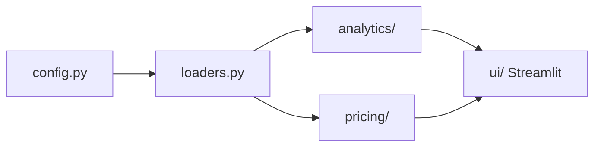

# Quantitative Finance Analytics Platform

Production-grade quantitative finance platform covering portfolio risk analytics, regression/classification modeling, GARCH volatility, derivatives pricing, and delta-neutral hedging -- with an interactive 4-tab Streamlit dashboard.

**4,400+ lines** | **171 tests (100% pass)** | **10 years of market data** | **6 trained models**

---

## Key Results

| Metric | Value |
|--------|-------|
| Portfolio cumulative return | **169.1%** (vs S&P 500 144.3%) |
| Portfolio Sharpe | 0.42 |
| CAPM Beta | 1.22 (banking sector exposure) |
| OLS RMSE improvement | **26.4%** over naive baseline |
| ML classifiers trained | 5 (DT, RF, KNN, SVM, Voting Ensemble) |
| Best classifier AUC-ROC | 0.54 |
| Feature engineering | 19 technical indicators, MI-filtered to 8 |
| GARCH persistence | 0.92 (mean-reverting) |
| Automated tests | 171 (100% pass rate) |

---

## Architecture

Four-layer modular monolith:

```
src/
  data/           Data ingestion (yfinance equity, FRED macro, merge_asof alignment)
    config.py       Single source of truth: tickers, weights, constants
    loaders.py      fetch_equity(), fetch_fred(), align_data(), get_all_data()

  analytics/      Portfolio metrics, OLS regression, ML classification, GARCH volatility
    portfolio.py    Sharpe, Sortino, CAPM, VaR, CVaR, max drawdown
    regression.py   AAPL OLS with VIF, Breusch-Pagan, Durbin-Watson, Jarque-Bera
    classification.py  BAC direction: DT, RF, KNN, SVM, Voting Ensemble, MI selection
    volatility.py   GARCH(1,1), EWMA, ARCH LM test, forecast, volatility cones

  pricing/        Black-Scholes, CRR binomial tree, delta-neutral hedging
    black_scholes.py  Vectorized BS pricing, all Greeks, IV solver, vol surface
    binomial.py       CRR tree (European/American), Greeks, early exercise premium
    hedging.py        Delta-neutral simulation, summary stats, optimal band search

  ui/             Streamlit dashboard (4 tabs)
    app.py            Main entry point, sidebar, tab routing
    tab_portfolio.py  Risk metrics, VaR, cumulative returns, correlation heatmap
    tab_prediction.py AAPL regression + BAC classification visualizations
    tab_derivatives.py  Interactive BS/CRR pricer, Greeks, 3D vol surface
    tab_hedging.py    Hedging simulator with P&L charts, band optimization
```


```mermaid
graph LR
    Config[config.py] --> Data[loaders.py]
    Data --> Analytics[analytics/]
    Data --> Pricing[pricing/]
    Analytics --> UI[ui/ Streamlit]
    Pricing --> UI
```

---

## Running the Project

### Prerequisites

| Requirement | Version | Notes |
|-------------|---------|-------|
| Python | 3.11+ | Required for type hint syntax (`dict \| None`) |
| Conda | Any recent | For environment management (or use `venv`) |
| Git | Any | To clone the repository |
| Internet | Required on first run | yfinance downloads 10 years of market data |

### Option A: Conda (Recommended)

```bash
# 1. Clone the repository
git clone <repo-url>
cd quant-platform

# 2. Create and activate conda environment
conda create -p ./quant python=3.11 -y
conda activate ./quant

# 3. Install all dependencies
pip install -r requirements.txt

# 4. Launch the dashboard
streamlit run src/ui/app.py
```

The app opens at **http://localhost:8501**. First load takes ~10-15 seconds to fetch market data (cached for 1 hour after that).

### Option B: venv (No Conda)

```bash
# 1. Clone and enter the project
git clone <repo-url>
cd quant-platform

# 2. Create virtual environment
python3.11 -m venv .venv
source .venv/bin/activate    # Linux/Mac
# .venv\Scripts\activate     # Windows

# 3. Install dependencies
pip install -r requirements.txt

# 4. Launch the dashboard
streamlit run src/ui/app.py
```

### Option C: Docker

```bash
# Build the image (~2-3 min first time)
docker build -t quant-platform .

# Run the container
docker run -p 8501:8501 quant-platform

# With FRED macro data
docker run -p 8501:8501 -e FRED_API_KEY=your_key quant-platform
```

### Enabling FRED Macro Data (Optional)

The app works fully without a FRED API key. To enable macro features (yield curve, VIX, GDP, CPI overlays in classification):

1. Get a free key at https://fred.stlouisfed.org/docs/api/api_key.html
2. Run with the key:
   ```bash
   # Via environment variable
   FRED_API_KEY=your_key streamlit run src/ui/app.py

   # Or enter it in the sidebar text field at runtime
   ```

### Running Tests

```bash
# All 171 tests (~90 seconds)
pytest tests/ -v

# Single test file
pytest tests/test_pricing.py -v

# Single test
pytest tests/test_pricing.py::TestBSPrice::test_hull_call -v
```

### Generating Resume Metrics

```bash
# Runs all analytics against real market data, prints bullet points
python scripts/generate_metrics.py

# Output saved to results/metrics_report.json
```

### Troubleshooting

| Issue | Solution |
|-------|----------|
| `ModuleNotFoundError: No module named 'src'` | Run from the project root: `cd quant-platform && streamlit run src/ui/app.py` |
| `No data found` on first load | Check internet connection -- yfinance needs to download stock data |
| Slow first load (~15s) | Normal -- fetching 10 years of data for 6 tickers. Cached for 1 hour after. |
| `arch` package install fails | Install build tools first: `pip install --upgrade pip setuptools wheel` |
| Port 8501 already in use | Kill existing process: `pkill -f streamlit` or use `--server.port 8502` |
| Memory issues on cloud | The app is optimized for 1GB RAM (float32 plotting, lazy tab loading, capped grids) |

---

## Dashboard Tabs

### Tab 1: Portfolio Analytics

Banking portfolio (MS, JPM, BAC) with equal weights.

- **Key metrics**: Sharpe, Sortino, Beta, Alpha (annualized), Max Drawdown
- **Value at Risk**: Parametric, Historical, CVaR with fat-tail detection
- **Charts**: Cumulative returns (all tickers + portfolio), return distribution with VaR lines, rolling 30-day volatility, correlation heatmap
- Full risk summary in expandable table

### Tab 2: Price Prediction

**AAPL Regression**: OLS with SMA, lag, and market features. Diagnostic suite (VIF, Breusch-Pagan, Durbin-Watson, Jarque-Bera). Actual vs predicted scatter, residuals, QQ plot, VIF bars.

**BAC Classification**: 5-model comparison table (accuracy, precision, recall, F1, AUC-ROC). ROC curves, Random Forest feature importance, confusion matrices, class distribution.

### Tab 3: Derivatives Pricing

Interactive option pricer with adjustable S, K, T, r, sigma.

- **Pricing**: Black-Scholes or CRR Binomial (with American exercise toggle)
- **Greeks**: Delta, Gamma, Vega, Theta, Rho in metric cards
- **Charts**: Payoff diagram, binomial convergence (N=10 to 500 vs BS), Greeks sensitivity (2x2), 3D price surface (20x15 strike x expiry grid)

### Tab 4: Hedging Simulator

Delta-neutral hedging simulation on historical spot prices.

- Select underlying ticker, strike, expiry, vol, transaction costs, rebalance band
- **Summary**: Net P&L, costs, rebalance count, Sharpe
- **Charts**: Spot price with rebalance markers, portfolio delta over time, cumulative P&L breakdown (share/option/costs/net)
- **Optimal band search**: Compare P&L and rebalances across band widths

---

## Modules

### Data Layer (`src/data/`)

| Function | Description |
|----------|-------------|
| `fetch_equity()` | yfinance download with retry, staleness check, NaN handling |
| `fetch_fred()` | FRED macro series with graceful degradation (returns None without key) |
| `align_data()` | `merge_asof(direction='backward', tolerance='90d')` -- no look-ahead bias |
| `compute_log_returns()` | `np.log(P / P.shift(1))` -- log returns only |
| `get_all_data()` | Orchestrator with `@st.cache_data(ttl=3600)` |

### Analytics Layer (`src/analytics/`)

**Portfolio** (`portfolio.py`): `sharpe_ratio`, `sortino_ratio`, `capm`, `var_parametric`, `var_historical`, `cvar`, `max_drawdown`, `risk_summary`

**Regression** (`regression.py`): `prepare_features` (SMA, lag, market features), `fit_ols` (with Ridge fallback), `diagnostics` (VIF, BP, DW, JB), `evaluate`, `run_regression`

**Classification** (`classification.py`): 18 technical indicators (SMA, RSI, MACD, Bollinger %B, Stochastic, ROC, RVol, Z-Score). RobustScaler. Mutual information feature selection. 4 classifiers + soft-voting ensemble. Optional hyperparameter tuning via `RandomizedSearchCV` with `TimeSeriesSplit`.

**Volatility** (`volatility.py`): `arch_lm_test`, `fit_garch` (with EWMA fallback), `fit_ewma`, `forecast_volatility`, `volatility_cones`, `realized_vs_predicted`, `run_volatility`

### Pricing Layer (`src/pricing/`)

**Black-Scholes** (`black_scholes.py`): Fully vectorized. `price()`, `greeks()` (all 6), `implied_volatility()` (Newton-Raphson + bisection), `vol_surface()`. Hull textbook validated.

**Binomial Tree** (`binomial.py`): CRR parameterization with vectorized backward induction. `crr_price()` (European/American), `crr_greeks()`, `american_premium()`. N capped at 1000. Converges to BS within 0.5% at N=500.

**Hedging** (`hedging.py`): `simulate_delta_hedge()` (daily rebalancing with bands and transaction costs), `hedging_summary()`, `optimal_band_search()`.

---

## Testing

171 tests across 7 files, all passing:

| File | Tests | Coverage |
|------|-------|----------|
| `test_data.py` | 3 | Data loaders, log returns, alignment |
| `test_portfolio.py` | 13 | Sharpe, Sortino, VaR, CVaR, CAPM, drawdown |
| `test_regression.py` | 16 | Feature prep, OLS fitting, diagnostics, evaluation |
| `test_classification.py` | 38 | All indicators, training, tuning, ensemble, MI, evaluation |
| `test_pricing.py` | 47 | BS (Hull validated), put-call parity, Greeks, IV, CRR convergence, American pricing |
| `test_volatility.py` | 34 | ARCH LM, GARCH params, EWMA, forecast, cones, realized vs predicted |
| `test_hedging.py` | 20 | Simulation, delta bounds, costs, band behavior, summary, band search |

```bash
pytest tests/ -v    # ~90 seconds
```

---

## Technical Constraints

These are enforced throughout the codebase:

- **Vectorization**: All numeric operations use numpy/pandas. No Python for-loops in pricing or analytics.
- **Log returns only**: `np.log(prices / prices.shift(1))`, never simple returns.
- **Adjusted Close only**: Never raw Close prices.
- **No look-ahead bias**: Macro data merged with `merge_asof(direction='backward')`.
- **Chronological splits**: Train/test splits are time-ordered (80/20), never random shuffle.
- **GARCH fallback**: If GARCH fails to converge, falls back to EWMA (lambda=0.94).
- **Black-Scholes T=0**: Returns intrinsic value, not NaN.
- **Binomial tree**: N capped at `MAX_TREE_STEPS=1000`.
- **FRED graceful degradation**: App works fully without a FRED API key.

---

## Configuration

All constants live in `src/data/config.py`:

| Constant | Value | Used By |
|----------|-------|---------|
| `TICKERS` | MS, JPM, BAC, AAPL, ^GSPC, ^IXIC | loaders |
| `PORTFOLIO_WEIGHTS` | 0.33 / 0.34 / 0.33 | portfolio |
| `DATE_RANGE` | 2015-01-01 to 2024-12-31 | loaders |
| `TRADING_DAYS` | 252 | all modules |
| `VIF_THRESHOLD` | 10 | regression |
| `VAR_CONFIDENCE` | 0.95 | portfolio |
| `EWMA_LAMBDA` | 0.94 | volatility |
| `MAX_TREE_STEPS` | 1000 | binomial |
| `MI_THRESHOLD` | 0.001 | classification |

---

## CI/CD

- **GitHub Actions**: `pytest tests/ -v` on every push/PR to main
- **Streamlit Community Cloud**: Auto-deploys from main branch
- **Docker**: Multi-stage build for local development

---

## Project Stats

| Metric | Value |
|--------|-------|
| Source code | 2,465 lines / 14 modules |
| Tests | 1,504 lines / 171 tests / 7 files |
| Scripts | 474 lines |
| Total | ~4,400 lines |
| Dependencies | 12 packages |
| Data range | 2015-2024 (10 years, ~2,500 trading days) |
| Models trained | 6 (OLS + DT + RF + KNN + SVM + Voting Ensemble) |
