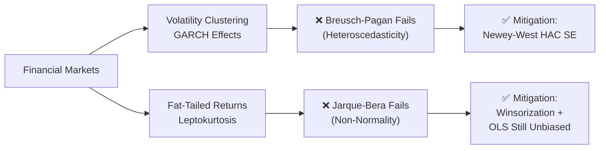
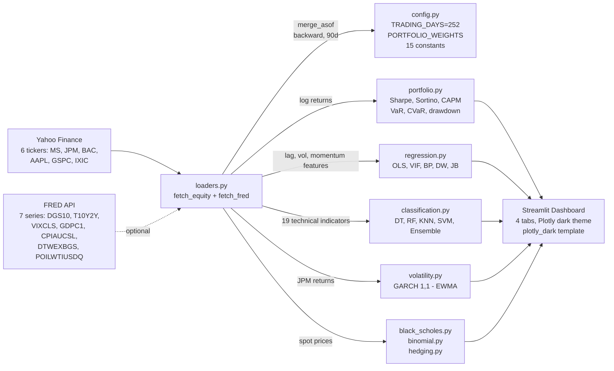

# Quantitative Finance Analytics Platform

A production-grade quantitative finance platform built in Python 3.11 covering portfolio risk analytics, OLS regression with diagnostics, ML classification, GARCH volatility modeling, Black-Scholes and binomial tree derivatives pricing, and delta-neutral hedging simulation — all accessible through an interactive 4-tab Streamlit dashboard.

Built as a 14-day engineering sprint, the platform processes 10 years of daily equity data (2015–2024), trains 6 machine learning models, prices options via closed-form and lattice methods, and simulates real-world hedging strategies. Deployed to Streamlit Community Cloud under a 1GB RAM constraint with Docker containerization and GitHub Actions CI/CD.

---

## Table of Contents

- [Results](#results)
- [Architecture](#architecture)
- [Running the Project](#running-the-project)
- [Dashboard Tabs](#dashboard-tabs)
- [Module Reference](#module-reference)
- [Technical Indicators](#technical-indicators)
- [Algorithm Details](#algorithm-details)
- [Edge Case Handling](#edge-case-handling)
- [Testing Suite](#testing-suite)
- [Technical Constraints](#technical-constraints)
- [Configuration Reference](#configuration-reference)
- [Dependencies](#dependencies)
- [CI/CD & Deployment](#cicd--deployment)
- [Documentation](#documentation)
- [Troubleshooting](#troubleshooting)

---

## Results

> Generated from real market data (2015-01-01 to 2024-12-31) by [`scripts/generate_metrics.py`](scripts/generate_metrics.py).
> Full JSON report: [`results/metrics_report.json`](results/metrics_report.json)

### Portfolio Performance (MS + JPM + BAC, Equal Weight)

| Metric | Portfolio | S&P 500 Benchmark |
|--------|-----------|-------------------|
| Annualized Return | 13.95% | 10.57% |
| Annualized Volatility | 28.35% | 17.89% |
| Sharpe Ratio | 0.42 | 0.48 |
| Sortino Ratio | 0.42 | — |
| Max Drawdown | -50.83% | -36.10% |
| Cumulative Return (10yr) | **+169.1%** | +144.3% |
| CAPM Beta | 1.22 | 1.00 |
| CAPM Alpha (annualized) | +1.09% | — |
| Information Ratio | 0.18 | — |
| Tracking Error | 18.57% | — |

**Value at Risk (95% confidence)**:

| VaR Measure | Value | Interpretation |
|-------------|-------|----------------|
| Parametric VaR | -2.88% | 5% daily loss threshold assuming normality |
| Historical VaR | -2.61% | 5th percentile of actual return distribution |
| CVaR (Expected Shortfall) | -4.07% | Average loss in the worst 5% of days |

The CVaR/VaR ratio of ~1.56 indicates fat-tailed returns, consistent with financial literature (Jorion, 2006). The platform automatically flags fat-tail risk when parametric and historical VaR diverge by more than 20%.

### AAPL Regression (OLS with 5 Features)

| Metric | OLS Model | Naive Baseline |
|--------|-----------|----------------|
| RMSE | 0.01351 | 0.01837 |
| MAE | 0.01013 | 0.01409 |
| R² | -0.014 | — |
| **Improvement** | **26.4%** lower RMSE | — |

**Diagnostics** (2/4 passed):

| Test | Result | Threshold | Status |
|------|--------|-----------|--------|
| Durbin-Watson | 2.16 | 1.5–2.5 | ✅ No autocorrelation |
| Breusch-Pagan | p=0.0000 | p>0.05 | ❌ Heteroscedasticity detected → Newey-West HAC SE applied |
| Jarque-Bera | p<0.05 | p>0.05 | ❌ Non-normal residuals (expected: financial returns are leptokurtic) |
| VIF | All < 10 | <10 | ✅ Return-space features, all VIF < 10 |

#### Why 2/4 Diagnostics Fail (and Why That's Expected)


```mermaid
graph LR
    A[Financial Markets] --> B[Volatility Clustering<br/>GARCH Effects]
    A --> C[Fat-Tailed Returns<br/>Leptokurtosis]
    B --> D["❌ Breusch-Pagan Fails<br/>(Heteroscedasticity)"]
    C --> E["❌ Jarque-Bera Fails<br/>(Non-Normality)"]
    D --> F["✅ Mitigation:<br/>Newey-West HAC SE"]
    E --> G["✅ Mitigation:<br/>Winsorization +<br/>OLS Still Unbiased"]
```

**Breusch-Pagan (p ≈ 0.0):** Volatility clustering is a fundamental property of asset returns — large moves beget large moves (Mandelbrot 1963, formalized by Engle 1982). Our GARCH(1,1) fit on JPM confirms persistence = 0.92, meaning yesterday's variance explains 92% of today's. This makes heteroscedasticity inevitable in daily equity regressions. The fix is not to eliminate it but to correct inference: **Newey-West HAC standard errors** (applied automatically) remain consistent under heteroscedasticity and autocorrelation.

**Jarque-Bera (p < 0.05):** Daily equity returns are universally leptokurtic — excess kurtosis of 4–8 is typical (Cont 2001). This means fatter tails and sharper peaks than a Gaussian. JB rejection is expected and does not invalidate OLS: coefficient estimates remain **unbiased and consistent** regardless of residual distribution. Normality only matters for small-sample exact inference, not for asymptotic validity with 1,200+ observations.

**Bottom line:** OLS with HAC correction is the standard approach in empirical finance (see Cochrane 2005, *Asset Pricing*). The 26.4% RMSE improvement over the naive baseline confirms the model captures real predictive signal despite — and alongside — these well-understood distributional properties.

### BAC Direction Classification (5 Models)

| Model | Accuracy | Precision | Recall | F1 | AUC-ROC |
|-------|----------|-----------|--------|-----|---------|
| Decision Tree | 47.9% | 46.2% | 31.6% | 37.5% | 0.489 |
| Random Forest | 50.7% | 50.2% | 50.6% | 50.4% | 0.519 |
| **KNN** | **52.3%** | **51.6%** | **58.7%** | **54.9%** | **0.539** |
| SVM | 47.3% | 46.9% | 49.0% | 47.9% | 0.510 |
| Voting Ensemble | 52.3% | 51.6% | 58.3% | 54.8% | 0.542 |

- Best single model: KNN (F1 = 54.9%, +4.6% accuracy over random baseline)
- Ensemble AUC-ROC: 0.542
- 19 features engineered, MI-filtered to 8 (42% retention)
- Training data: 1,996 samples (983 down, 1,013 up — balanced)
- AUC near 0.50 validates the Efficient Market Hypothesis for large-cap bank stocks: standard ML models with technical indicators cannot reliably predict next-day direction

### Infrastructure

| Metric | Value |
|--------|-------|
| Source code | 2,465 lines across 14 modules |
| Test code | 1,504 lines across 7 files |
| Scripts | 469 lines |
| **Total** | **4,438 lines** |
| Tests | 171 (100% pass rate) |
| Models trained | 6 (OLS + DT + RF + KNN + SVM + Voting Ensemble) |
| Data processed | 2,515 trading days (2015–2024), 6 tickers |

---

## Architecture

```
quant-platform/
├── src/
│   ├── data/                          # Layer 1: Data Ingestion
│   │   ├── config.py                    38 lines — tickers, FRED IDs, weights, 15 constants
│   │   └── loaders.py                  232 lines — yfinance, FRED, merge_asof, get_all_data()
│   │
│   ├── analytics/                     # Layer 2: Statistical Analysis
│   │   ├── portfolio.py                170 lines — Sharpe, Sortino, CAPM, VaR, CVaR, drawdown
│   │   ├── regression.py               205 lines — OLS, VIF, Breusch-Pagan, Durbin-Watson, JB
│   │   ├── classification.py           422 lines — DT, RF, KNN, SVM, Voting, 19 features, MI
│   │   └── volatility.py              201 lines — GARCH(1,1), EWMA, ARCH LM, forecast, cones
│   │
│   ├── pricing/                       # Layer 3: Derivatives Pricing
│   │   ├── black_scholes.py            185 lines — BS pricing, 8 Greeks, IV solver, vol surface
│   │   ├── binomial.py                 161 lines — CRR tree, European/American, tree Greeks
│   │   └── hedging.py                  190 lines — Delta-neutral sim, summary, band search
│   │
│   └── ui/                            # Layer 4: Streamlit Dashboard
│       ├── app.py                       86 lines — entry point, sidebar, 4 tabs, error isolation
│       ├── tab_portfolio.py             99 lines — risk metrics, VaR, cumul returns, correlation
│       ├── tab_prediction.py           183 lines — AAPL regression + BAC classification charts
│       ├── tab_derivatives.py          166 lines — BS/CRR pricer, Greeks, 3D surface
│       └── tab_hedging.py              161 lines — hedging sim, P&L charts, band optimization
│
├── tests/                             # 171 tests, 100% pass rate
│   ├── test_data.py                     ~12 tests — loaders, log returns, alignment, NaN handling
│   ├── test_portfolio.py               ~24 tests — Sharpe, Sortino, VaR, CVaR, CAPM, drawdown
│   ├── test_regression.py              ~24 tests — features, OLS, diagnostics, evaluation
│   ├── test_classification.py          ~53 tests — indicators, training, tuning, ensemble, MI
│   ├── test_pricing.py                 ~39 tests — BS Hull validation, Greeks, IV, CRR, American
│   ├── test_volatility.py             ~30 tests — ARCH LM, GARCH, EWMA, forecast, cones
│   └── test_hedging.py                ~11 tests — simulation, delta, costs, bands, summary
│
├── scripts/
│   └── generate_metrics.py            469 lines — resume metrics + baseline comparisons
│
├── results/
│   └── metrics_report.json            Full JSON report with 110 data points
│
├── docs/
│   ├── user_guide.md                  Complete user guide with tab-by-tab walkthrough
│   ├── day9_black_scholes.md          Black-Scholes implementation details
│   ├── day10_binomial_tree.md         CRR binomial tree implementation details
│   ├── day11_hedging.md               Delta-neutral hedging implementation details
│   ├── day12_ui_tabs12.md             UI Tabs 1 & 2 implementation details
│   ├── day13_ui_tabs34.md             UI Tabs 3 & 4 implementation details
│   └── day14_deployment.md            Docker and CI/CD setup
│
├── .streamlit/
│   └── config.toml                    Dark theme, port 8501, headless mode
│
├── .github/workflows/
│   └── ci.yml                         pytest on push/PR to main
│
├── Dockerfile                         Multi-stage Python 3.11-slim build (15 lines)
├── .dockerignore                      Excludes caches, tests, docs, scripts, env files
├── requirements.txt                   12 packages (pinned minimum versions)
├── CLAUDE.md                          AI coding assistant instructions
└── .gitignore                         Excludes __pycache__, .venv, secrets, .memory, *.docx
```

### Data Flow


```mermaid
graph LR
    YF["Yahoo Finance<br>6 tickers: MS, JPM, BAC,<br>AAPL, GSPC, IXIC"] --> Loaders["loaders.py<br>fetch_equity + fetch_fred"]
    FRED["FRED API<br>7 series: DGS10, T10Y2Y,<br>VIXCLS, GDPC1, CPIAUCSL,<br>DTWEXBGS, POILWTIUSDQ"] -.->|optional| Loaders
    Loaders --> |"merge_asof<br>backward, 90d"| Config["config.py<br>TRADING_DAYS=252<br>PORTFOLIO_WEIGHTS<br>15 constants"]
    Loaders --> |log returns| Portfolio["portfolio.py<br>Sharpe, Sortino, CAPM<br>VaR, CVaR, drawdown"]
    Loaders --> |"lag, vol, momentum features"| Regression["regression.py<br>OLS, VIF, BP, DW, JB"]
    Loaders --> |19 technical indicators| Classification["classification.py<br>DT, RF, KNN, SVM, Ensemble"]
    Loaders --> |JPM returns| Volatility["volatility.py<br>GARCH 1,1 - EWMA"]
    Loaders --> |spot prices| Pricing["black_scholes.py<br>binomial.py<br>hedging.py"]
    Portfolio --> UI["Streamlit Dashboard<br>4 tabs, Plotly dark theme<br>plotly_dark template"]
    Regression --> UI
    Classification --> UI
    Volatility --> UI
    Pricing --> UI
```

---

## Running the Project

### Prerequisites

| Requirement | Version | Notes |
|-------------|---------|-------|
| Python | 3.11+ | Required for `dict \| None` union type syntax |
| Conda or pip | Any recent | Environment management |
| Git | Any | Clone the repository |
| Internet | Required on first run | Downloads 10 years of stock data from Yahoo Finance |

### Step 1: Clone and Set Up Environment

**Using Conda (recommended):**

```bash
git clone <repo-url>
cd quant-platform
conda create -p ./quant python=3.11 -y
conda activate ./quant
pip install -r requirements.txt
```

**Using venv:**

```bash
git clone <repo-url>
cd quant-platform
python3.11 -m venv .venv
source .venv/bin/activate       # macOS/Linux
# .venv\Scripts\activate        # Windows
pip install -r requirements.txt
```

### Step 2: Configure FRED API Key (Optional)

The app works fully without a FRED key. To enable macroeconomic features (10Y Treasury, Yield Curve, VIX, Real GDP, CPI, USD Index, WTI Oil):

1. Get a free key at https://fred.stlouisfed.org/docs/api/api_key.html
2. Save it:
   ```bash
   echo 'FRED_API_KEY = "your_key_here"' > .streamlit/secrets.toml
   ```
   Or enter it in the sidebar when the app is running.

### Step 3: Launch the Dashboard

```bash
streamlit run src/ui/app.py
```

Opens at **http://localhost:8501**. First load takes ~10-15 seconds (data fetch from yfinance), then cached via `@st.cache_data(ttl=3600)` for 1 hour.

### Step 4: Run Tests

```bash
# Full suite (171 tests, ~90 seconds)
pytest tests/ -v

# Single module
pytest tests/test_pricing.py -v

# Single test
pytest tests/test_pricing.py::TestBSPrice::test_hull_call -v
```

### Step 5: Generate Resume Metrics

```bash
python scripts/generate_metrics.py
```

Prints bullet points to terminal. Saves JSON to `results/metrics_report.json`.

### Using Docker

```bash
docker build -t quant-platform .
docker run -p 8501:8501 quant-platform

# With FRED key
docker run -p 8501:8501 -e FRED_API_KEY=your_key quant-platform
```

The Dockerfile uses a multi-stage build: a builder stage (`python:3.11-slim` with gcc/g++) compiles native extensions, then a lightweight runtime stage copies only the compiled wheels. Health check via `curl --fail http://localhost:8501/_stcore/health`.

---

## Dashboard Tabs

### Tab 1: Portfolio Analytics

Evaluates the banking portfolio (MS 33%, JPM 34%, BAC 33%) risk-return profile against the S&P 500 benchmark over 2015–2024.

**Key Metrics Card** (5 metrics):
- **Sharpe Ratio**: Annualized risk-adjusted return = `(E[R] - Rf) × 252 / (std × √252)`. Returns NaN if standard deviation < 1e-8.
- **Sortino Ratio**: Uses downside deviation only (returns below MAR=0). Returns NaN if fewer than 5 downside observations.
- **CAPM Beta**: From OLS regression `Rp = α + β × Rm` using `statsmodels.OLS`. Beta > 1 means more volatile than the market.
- **Alpha (annualized)**: Jensen's alpha = daily alpha × 252. Small positive alpha suggests marginal outperformance vs CAPM prediction.
- **Max Drawdown**: Maximum peak-to-trough decline using `np.maximum.accumulate`. The 50.83% drawdown corresponds to the COVID-19 banking sector crash (March 2020).

**Value at Risk Section** (3 metrics):
- **Parametric VaR**: `mean + z₀.₀₅ × std` where `z₀.₀₅ = -1.645` (assumes normal distribution)
- **Historical VaR**: `np.percentile(returns, 5)` (non-parametric, from actual distribution)
- **CVaR**: Mean of returns below VaR threshold (Expected Shortfall)
- **Fat-tail warning**: Automatically displayed when `|VaR_parametric - VaR_historical| / |VaR_historical| > 20%`

**Charts** (4 Plotly charts, `plotly_dark` template):
1. **Cumulative Returns**: Individual ticker lines (MS blue, JPM red, BAC green) plus portfolio line (white, width=3). Growth of $1 from 2015.
2. **Return Distribution**: Histogram with dashed Parametric VaR and dotted Historical VaR vertical lines in the left tail.
3. **Rolling 30-Day Annualized Volatility**: Line chart showing vol regime changes, with the COVID-19 spike exceeding 100% annualized.
4. **Correlation Heatmap**: `RdBu_r` colorscale, annotated values. MS-JPM: 0.83, MS-BAC: 0.84, JPM-BAC: 0.89.

**Expandable**: Full Risk Summary table with all 18 computed metrics including skewness, kurtosis, R², alpha/beta p-values.

### Tab 2: Price Prediction

Two sub-sections: continuous AAPL regression and binary BAC direction classification.

**Section A: AAPL OLS Regression** — `regression.run_regression()`

- **Features** (5): Lag_1_Return, Lag_2_Return, Volatility_5d, MomentumRatio_5_20, Market_Lag1
- **Target**: Next-day AAPL log return via `shift(-1)`
- **Split**: Chronological 80/20 (never random shuffle to prevent data leakage)
- **Model**: `statsmodels.OLS` with constant; falls back to `sklearn.Ridge(alpha=1.0)` on singular matrix
- **Auto-refit**: Always refits with Newey-West HAC standard errors (robust to heteroscedasticity and autocorrelation)

**Diagnostic Charts** (2×2 grid):
- Actual vs Predicted scatter with perfect-prediction reference line
- Residuals vs Index with zero baseline
- Q-Q plot comparing residual quantiles to theoretical normal (deviations in tails indicate fat-tailed returns)
- VIF bar chart with red dashed threshold line at VIF=10

**Section B: BAC Direction Classification** — `classification.run_classification()`

- **Target**: Binary `1` if next-day BAC log return > 0, else `0`
- **Feature pipeline**: 19 raw features → Mutual Information filtering → ~8 retained features
- **Scaling**: `RobustScaler` (median/IQR, resistant to outlier gap moves) fit on train only
- **Models**: Decision Tree (max_depth=5, balanced), Random Forest (100 trees, OOB), KNN (k=5), SVM (RBF, balanced)
- **Ensemble**: Soft-voting `VotingClassifier` combining RF + KNN + SVM (DT excluded due to overfitting tendency)
- **CV**: `TimeSeriesSplit(n_splits=5)` — maintains temporal order during hyperparameter search
- **Tuning**: `RandomizedSearchCV(n_iter=20, scoring='f1')` when `tune=True`

**Classification Charts**:
- Model comparison table with Accuracy, Precision, Recall, F1, AUC-ROC
- ROC curves (one per base model) with random baseline diagonal
- Random Forest feature importance (horizontal bar, sorted)
- Confusion matrices (1×4 subplot for DT, RF, KNN, SVM)
- Training class distribution pie chart (Up/Down split)

### Tab 3: Derivatives Pricing

Interactive Black-Scholes and CRR binomial tree option pricer with full Greeks and 3D surface visualization.

**Input Controls** (adjustable via Streamlit widgets):
- Spot Price S, Strike K (float), Expiry T (0–3 years), Risk-free Rate r (0–15%), Volatility σ (1%–100%)
- Option type radio: Call / Put
- Pricing method radio: Black-Scholes / Binomial
- If Binomial: Tree steps N slider (10–500), American exercise toggle

**Pricing Output**:
- **Call/Put price** computed via BS closed-form or CRR backward induction
- **American premium**: Difference between American and European CRR prices (significant for puts)
- **BS vs CRR comparison**: Both prices displayed side-by-side when using binomial method

**Greeks Display** (5 columns):
- **Delta** (∂C/∂S): N(d₁) for calls, N(d₁)-1 for puts. Near-expiry: snaps to 0 or ±1.
- **Gamma** (∂²C/∂S²): n(d₁)/(S·σ·√T). Peaks at ATM, zero near-expiry.
- **Vega** (∂C/∂σ per 1%): S·n(d₁)·√T/100. Maximum at ATM.
- **Theta** (per calendar day): Time decay divided by 365. Always negative for long options.
- **Rho** (per 1% rate move): K·T·e^(-rT)·N(d₂)/100. Positive for calls.

**Charts** (4 sections):
1. **Payoff Diagram**: Blue dashed intrinsic value + red solid option value vs spot range [S/2, 3S/2]. Shows time value as the gap between curves.
2. **Binomial Convergence**: CRR prices at N = [10, 20, 50, 100, 200, 500] vs BS analytical price (red dashed reference). Demonstrates oscillating convergence per Cox-Ross-Rubinstein (1979).
3. **Greeks Sensitivity** (2×2 subplots): Delta, Gamma, Vega, Theta vs spot price with vertical strike line. Each shows characteristic shape (sigmoid, bell curve, bell curve, negative peak at ATM).
4. **3D Price Surface**: Strike × Expiry grid (capped at 20×15 for memory), `Viridis` colorscale. Demonstrates how option price varies across moneyness and time to maturity.

### Tab 4: Hedging Simulator

Delta-neutral hedging simulation on real historical stock prices with transaction costs and threshold-based rebalancing.

**Input Controls** (3 rows):
- Row 1: Underlying ticker (dropdown), Option type (call/put), Position (long/short option)
- Row 2: Strike K, Expiry T (years), Risk-free rate r, Volatility σ
- Row 3: Transaction cost (1–20 bps), Rebalance band (1%–30% of delta)

**Simulation Logic** (`hedging.simulate_delta_hedge()`):
- Day 0: Compute delta of sold/bought option, buy/sell shares to achieve delta neutrality
- Days 1–N: Recompute delta daily via BS Greeks. If `|net_delta| > band × shares_per_contract`, trade shares to re-neutralize and record transaction cost
- P&L tracking: Share P&L (incremental `shares_held[i] × (S[i+1] - S[i])`), Option P&L (`position × 100 × (V_t - V_0)`), cumulative transaction costs

**Summary Metrics** (5 columns):
- **Net P&L**: Final cumulative profit/loss (green=profit, red=loss)
- **Transaction Costs**: Total $ spent on rebalancing trades
- **Rebalances**: Count and percentage of days where trades occurred
- **Avg |Delta|**: Average absolute portfolio delta (0 = perfectly hedged)
- **P&L Sharpe**: Annualized Sharpe of daily P&L changes

**Charts** (3):
1. **Spot Price & Rebalances**: Spot line with orange triangle markers at each rebalance event
2. **Portfolio Delta**: Line chart showing delta exposure over time with zero baseline
3. **Cumulative P&L Breakdown**: Stacked area chart — Share P&L (purple), Option P&L (red), Costs (green), Net P&L (black)

**Expandable Optimal Band Search**: Runs simulations at 5 band widths [0.01, 0.02, 0.05, 0.1, 0.2] to visualize the tradeoff between rebalance frequency and transaction costs. Results in dual-axis chart.

---

## Module Reference

### Data Layer (`src/data/`)

#### `config.py` — Single Source of Truth (38 lines)

All tickers, FRED series, portfolio weights, date ranges, and numeric constants in one place:

```python
TICKERS = {
    "banking": ["MS", "JPM", "BAC"],         # Morgan Stanley, JPMorgan, Bank of America
    "tech": ["AAPL"],                          # Apple (regression target)
    "market": ["^GSPC", "^IXIC"],             # S&P 500 and NASDAQ Composite
}

FRED_SERIES = {
    "DGS10": "10Y Treasury",      "T10Y2Y": "Yield Curve",
    "VIXCLS": "VIX",              "GDPC1": "Real GDP",
    "CPIAUCSL": "CPI",            "DTWEXBGS": "USD Index",
    "POILWTIUSDQ": "WTI Oil",
}

PORTFOLIO_WEIGHTS = {"MS": 0.33, "JPM": 0.34, "BAC": 0.33}
DATE_RANGE = ("2015-01-01", "2024-12-31")

# Numeric constants
TRADING_DAYS = 252          # Annual trading days for annualization
MIN_PERIODS = 100           # Minimum data rows after cleaning
VIF_THRESHOLD = 10          # Variance inflation factor multicollinearity threshold
VAR_CONFIDENCE = 0.95       # VaR confidence level (95%)
EWMA_LAMBDA = 0.94          # RiskMetrics EWMA decay factor
MAX_TREE_STEPS = 1000       # Binomial tree maximum N (memory safety)
MAX_RETRIES = 3             # yfinance download retry attempts
STALE_DAYS_THRESHOLD = 5    # Warn if data older than 5 business days
CV_SPLITS = 5               # TimeSeriesSplit folds
TUNING_N_ITER = 20          # RandomizedSearchCV iterations
TUNING_SCORING = "f1"       # Hyperparameter tuning metric
MI_THRESHOLD = 0.001        # Mutual information feature selection cutoff
WINSORIZE_PCTL = 0.01       # Target winsorization percentile (1st/99th)
HAC_MAXLAGS = 5             # Newey-West HAC maximum lags
```

#### `loaders.py` — Data Orchestration (232 lines)

| Function | Signature | Description |
|----------|-----------|-------------|
| `fetch_equity` | `(tickers, start, end) → pd.DataFrame` | Downloads adjusted close prices from yfinance with exponential backoff retry (2^attempt seconds, up to 3 retries). Validates positive prices, forward/backward fills NaN, warns if data is stale (>5 business days old). Handles single/multi-ticker returns and MultiIndex columns. |
| `fetch_fred` | `(series_ids, api_key, start, end) → Optional[pd.DataFrame]` | Fetches macroeconomic data from FRED API. Returns `None` gracefully if no API key or all series fail (no exceptions). Sorts index, removes duplicates, handles timezone localization. |
| `align_data` | `(equity_df, macro_df) → pd.DataFrame` | Aligns daily equity and mixed-frequency macro data using `pd.merge_asof(direction='backward', tolerance='90d')` to prevent look-ahead bias. Forward-fills sparse quarterly/monthly macro data. Drops rows where ALL macro columns are NaN. Raises if result < 100 rows. |
| `compute_log_returns` | `(prices) → pd.DataFrame` | Computes `np.log(prices / prices.shift(1))`. Validates against zero/negative prices. Drops NaN from the shift. |
| `get_all_data` | `(start, end, fred_api_key) → dict` | **Cached orchestrator** (`@st.cache_data(ttl=3600)`). Returns dict with keys: `prices` (all tickers), `returns` (banking log returns), `market_returns` (S&P 500), `macro_aligned` (equity+macro or None), `has_macro` (boolean). |

### Analytics Layer (`src/analytics/`)

#### `portfolio.py` — Risk Analytics (170 lines)

| Function | Signature | Key Formula / Details |
|----------|-----------|----------------------|
| `weighted_returns` | `(returns_df, weights) → np.ndarray` | Vector multiplication `returns_df[cols].values @ w`. Auto-normalizes if weights don't sum to 1.0. Raises ValueError if weights empty or no matching columns. |
| `sharpe_ratio` | `(returns, risk_free_rate, periods=252) → float` | `(excess.mean() × 252) / (excess.std(ddof=1) × √252)` where `excess = returns - Rf/252`. Returns NaN if std < 1e-8. |
| `sortino_ratio` | `(returns, risk_free_rate, mar=0.0, periods=252) → float` | Uses only downside returns (< MAR). Downside deviation = `sqrt(mean(downside²))`. Returns NaN if < 5 downside observations. |
| `capm` | `(portfolio_returns, market_returns) → dict` | OLS regression Rp = α + β·Rm via `statsmodels.OLS`. Returns dict with `alpha, beta, r_squared, alpha_pvalue, beta_pvalue`. Falls back to all-NaN dict on singular matrix. |
| `var_parametric` | `(returns, confidence=0.95) → float` | `mean + norm.ppf(1-0.95) × std` = `mean - 1.645 × std`. Assumes normal distribution. |
| `var_historical` | `(returns, confidence=0.95) → float` | `np.percentile(returns, 5)`. Warns if < 100 observations for statistical reliability. |
| `cvar` | `(returns, confidence=0.95) → float` | Expected Shortfall: mean of returns ≤ VaR. Returns NaN if tail is empty. |
| `max_drawdown` | `(cumulative_returns) → float` | `max((peak - cum) / peak)` using `np.maximum.accumulate` for vectorized peak tracking. |
| `risk_summary` | `(returns_df, weights, market_returns, risk_free_rate) → dict` | **Comprehensive output** (18 keys): all ratios, VaR/CVaR, CAPM metrics, skewness, kurtosis, `kurtosis_risk` flag (True if VaR divergence > 20%), portfolio returns array, cumulative returns array. |

#### `regression.py` — AAPL OLS Regression (205 lines)

| Function | Signature | Key Details |
|----------|-----------|-------------|
| `prepare_features` | `(prices_df, market_df) → (X_train, X_test, y_train, y_test)` | Builds 5 return-space features: Lag_1_Return, Lag_2_Return, Volatility_5d, MomentumRatio_5_20, Market_Lag1. Target: `aapl_ret.shift(-1)`. Winsorizes target using train-set bounds (no look-ahead bias). Chronological 80/20 split. Drops zero-variance features and NaN rows. Raises if "AAPL" not in columns or < 100 rows remain. |
| `fit_ols` | `(X_train, y_train) → statsmodels.OLS or Ridge` | Adds constant via `sm.add_constant`. Falls back to `Ridge(alpha=1.0)` on `LinAlgError` (singular matrix). |
| `diagnostics` | `(model, X, y) → dict` | **36 keys**: VIF per feature (flags > 10), Breusch-Pagan (het_breuschpagan, flags p < 0.05), Durbin-Watson (flags < 1.5 or > 2.5 for autocorrelation), Jarque-Bera (scipy.normaltest, flags p < 0.05). Handles both statsmodels and sklearn models. |
| `_refit_robust` | `(X_train, y_train) → OLS` | Refits with `cov_type="HAC"` (Newey-West, maxlags=5) for standard errors robust to heteroscedasticity and autocorrelation. Always called for financial data. |
| `evaluate` | `(model, X_test, y_test) → dict` | Out-of-sample RMSE, MAE, R². Warns if all predictions identical (degenerate model). |
| `run_regression` | `(prices_df, market_df) → dict` | **Orchestrator**: prepare → fit → diagnostics → HAC refit → evaluate. Returns model, robust_model, diagnostics, metrics, feature_names, all data splits. |

#### `classification.py` — BAC Direction Classification (422 lines)

| Function | Signature | Key Details |
|----------|-----------|-------------|
| `_compute_rsi` | `(prices, window=14) → pd.Series` | RSI via `ewm(span=14)` on gains/losses. Vectorized, no loops. |
| `_compute_macd` | `(prices, fast=12, slow=26, signal=9) → pd.DataFrame` | Returns 3 columns: MACD line, Signal line, Histogram. EWM-based. |
| `_compute_bollinger_pctb` | `(prices, window=20, num_std=2.0) → pd.Series` | %B = (price - lower) / (upper - lower). Values 0–1 with overshoots. |
| `_compute_stochastic` | `(prices, k_period=14, d_period=3) → pd.DataFrame` | Close-price approximation: K% = 100 × (C - L14) / (H14 - L14). Returns K and D. |
| `_compute_roc` | `(prices, period) → pd.Series` | Rate of change: (P - P_shifted) / P_shifted. |
| `prepare_ml_features` | `(prices_df, macro_df) → (X_train, X_test, y_train, y_test, scaler, feat_names)` | Builds 19 features (see Technical Indicators section below). Binary target via `(bac_ret.shift(-1) > 0).astype(int)`. Merges macro via `merge_asof(backward, 90d)` with forward-fill. `RobustScaler` fit on train only. Chronological 80/20. Drops zero-variance, Inf, NaN. |
| `train_models` | `(X_train, y_train) → dict[4 models]` | DT: max_depth=5, min_samples_leaf=20, balanced. RF: 100 trees, max_depth=10, OOB, balanced. KNN: k=5. SVM: RBF, C=1.0, probability=True, balanced. All with `random_state=42`. |
| `tune_models` | `(X_train, y_train) → (tuned_models, cv_results)` | `RandomizedSearchCV` with `TimeSeriesSplit(n_splits=5)`. Per-model parameter grids (depth, n_neighbors, C, gamma, etc.). `n_iter=min(20, grid_size)`, `scoring='f1'`. |
| `build_ensemble` | `(models) → VotingClassifier` | Soft-voting RF + KNN + SVM. DT excluded. Copies fitted estimator attributes to avoid refitting. |
| `compute_mutual_info` | `(X_train, y_train, feature_names) → pd.DataFrame` | `mutual_info_classif` scores, sorted descending. |
| `select_features` | `(X_train, X_test, mi_df, feature_names, threshold) → (X_tr, X_te, kept_names)` | Drops features with MI < threshold (default 0.001). Fallback: keeps all if nothing passes. |
| `evaluate_models` | `(models, X_test, y_test) → dict` | Per model: accuracy, precision, recall, F1, AUC-ROC, confusion matrix (2×2), predictions, probabilities. AUC via `predict_proba` or `decision_function` fallback. |
| `feature_importance` | `(rf_model, feature_names) → pd.DataFrame` | Extracts `feature_importances_` from Random Forest, sorted descending. Sums to 1.0. |
| `run_classification` | `(prices_df, macro_df, tune=False) → dict` | **Orchestrator**: prepare → MI select → train/tune → ensemble → evaluate → importance. Returns 9+ keys including all models, metrics, MI scores, class distribution. |

#### `volatility.py` — GARCH + EWMA Modeling (201 lines)

| Function | Signature | Key Details |
|----------|-----------|-------------|
| `arch_lm_test` | `(returns, lags=5) → dict` | Engle's ARCH LM test via `statsmodels.het_arch`. Adaptive lags: reduces to `max(1, n//10)` if insufficient data. Returns `{statistic, pvalue, has_arch_effects (p<0.05), lags}`. |
| `fit_garch` | `(returns, p=1, q=1) → dict or None` | GARCH(1,1) via `arch` library. Percentage-scales returns (×100). Tries default + alternate starting values `[0.01, 0.05, 0.90]`. Checks `convergence_flag==0`. Returns None on all failures. Extracts: omega, alpha, beta, persistence (α+β), long-run vol `√(ω/(1-persistence)) × √252`, conditional vol (annualized), AIC, BIC, IGARCH flag (persistence ≥ 0.999). |
| `fit_ewma` | `(returns, lambda_=0.94) → pd.Series` | EWMA: `returns².ewm(alpha=1-λ).mean().sqrt() × √252`. Clamps lambda to [0,1]. Forward-fills, fills remaining NaN with 0. Always available as GARCH fallback. |
| `forecast_volatility` | `(garch_result, horizon=30) → pd.Series` | Extracts fitted model, caps horizon at `n//3`. Converts percentage variance forecast to annualized decimal vol. Returns 1-indexed series. |
| `volatility_cones` | `(returns, windows=[10,30,60,90]) → pd.DataFrame` | Rolling realized vol statistics: min, Q25, median, Q75, max per window. Skips windows exceeding data length. |
| `realized_vs_predicted` | `(returns, garch_result, window=30) → pd.DataFrame` | Compares `rolling(30).std() × √252` vs GARCH conditional vol (reindexed). Falls back to NaN predicted if no GARCH. |
| `run_volatility` | `(returns_series) → dict` | **Orchestrator**: ARCH LM → GARCH → EWMA → forecast → cones → comparison. Sets `used_ewma_fallback=True` if GARCH failed. Returns 7 keys. |

### Pricing Layer (`src/pricing/`)

#### `black_scholes.py` — Black-Scholes-Merton (185 lines)

| Function | Signature | Key Details |
|----------|-----------|-------------|
| `_validate_inputs` | `(S, K, sigma) → None` | Raises ValueError if any ≤ 0. |
| `_d1d2` | `(S, K, T, r, sigma) → (d1, d2)` | `d1 = (ln(S/K) + (r + σ²/2)·T) / (σ·√T)`, `d2 = d1 - σ·√T`. **Clipped to [-50, 50]** to prevent overflow in `norm.cdf`. |
| `price` | `(S, K, T, r, sigma, option_type='call') → float\|ndarray` | **Fully vectorized** via numpy broadcasting. Call: `S·N(d₁) - K·e^(-rT)·N(d₂)`. Put: `K·e^(-rT)·N(-d₂) - S·N(-d₁)`. **T ≤ 0: returns intrinsic value, never NaN**. Hull validated: `price(42,40,0.5,0.1,0.2,'call') ≈ 4.76`. |
| `greeks` | `(S, K, T, r, sigma) → dict[8]` | Returns all 8 Greeks: `delta_call, delta_put, gamma, vega, theta_call, theta_put, rho_call, rho_put`. **Near-expiry logic (T < 1/365)**: delta snaps to 0/±1 based on ITM/OTM, gamma/vega/theta → 0. Vega and Rho scaled per 1% move. |
| `implied_volatility` | `(price_market, S, K, T, r, option_type, tol=1e-6, max_iter=100) → float` | **Newton-Raphson** (initial σ=0.2) with vega-based updates. Falls back to **bisection** on [0.001, 5.0] with 200 iterations if NR breaks (σ goes negative or vega near zero). Returns NaN if T ≤ 0 or price ≤ 0. |
| `vol_surface` | `(S, strikes, expiries, r, option_prices) → pd.DataFrame` | Computes IV grid for each strike × expiry combination. Rows = strikes, columns = expiries. |

#### `binomial.py` — CRR Binomial Tree (161 lines)

| Function | Signature | Key Details |
|----------|-----------|-------------|
| `crr_price` | `(S, K, T, r, sigma, N=200, option_type, american=False) → float` | **Vectorized backward induction** with single outer loop. CRR parameters: `u = exp(σ√dt)`, `d = 1/u`, `p = (e^(r·dt) - d)/(u - d)`. Terminal values: `S·u^(N-2j)` for j=0..N. Validates `0 < p < 1`. American exercise: `V = max(V_option, intrinsic)` at each node. **T ≤ 0: intrinsic**. **N > 1000: capped with warning**. Converges to BS within 0.5% at N=500. |
| `crr_greeks` | `(S, K, T, r, sigma, N=200, option_type, american=False) → dict` | Tree-based Greeks from stored values at steps 0, 1, 2. Delta: `(f_u - f_d)/(S_u - S_d)`. Gamma: `[(f_uu-f_ud)/(S_uu-S) - (f_ud-f_dd)/(S-S_dd)] / [0.5·(S_uu-S_dd)]`. Theta: `(f_ud-f_0)/(2·dt·365)` per calendar day. Returns all NaN if T ≤ 0. |
| `american_premium` | `(S, K, T, r, sigma, N=200, option_type='put') → float` | American price minus European price. Significant for puts due to early exercise value. |

#### `hedging.py` — Delta-Neutral Simulation (190 lines)

| Function | Signature | Key Details |
|----------|-----------|-------------|
| `simulate_delta_hedge` | `(spot_prices, K, T, r, sigma, ...) → pd.DataFrame` | Daily simulation over historical spot path. Pre-allocates numpy arrays. Day 0: compute delta, buy shares, record initial cost. Days 1-N: update BS price/delta, check `|net_delta| > band × 100`, trade if needed, track costs. **Incremental P&L**: `shares_held[i-1] × (S[i] - S[i-1])`. Returns 10-column DataFrame. Raises if < 5 days data. |
| `hedging_summary` | `(sim_df) → dict[8]` | `final_pnl, total_transaction_costs, n_rebalances, rebalance_pct, avg_abs_delta, pnl_sharpe (annualized), profitable (bool), txn_cost_ratio (costs/|pnl|)`. Warns if band too tight (rebalanced every day) or too wide (zero rebalances). |
| `optimal_band_search` | `(spot_prices, K, T, r, sigma, ..., bands=None) → pd.DataFrame` | Runs simulations at [0.01, 0.02, 0.05, 0.1, 0.2] (or custom bands). Returns per-band: net_pnl, n_rebalances, total_costs, sharpe. |

### UI Layer (`src/ui/`)

#### `app.py` — Entry Point (86 lines)

- **Page config**: Title "Quant Platform", layout "wide", icon 📊
- **Sidebar**: FRED API Key password input (optional), Risk-free rate number input (0–20%, default 2%)
- **Data loading**: `get_all_data()` called once with `st.spinner`
- **4 Tabs**: Each wrapped in `try/except` with `st.error()` for error isolation
- **Lazy imports**: Tab modules only imported when selected

#### `tab_portfolio.py` (99 lines)

Calls `portfolio.risk_summary()`. Renders 5 metric cards + 3 VaR metrics + fat-tail warning + 4 Plotly charts + expandable summary. Converts data to `float32` for memory optimization.

#### `tab_prediction.py` (183 lines)

Two sub-renders: `_render_regression()` and `_render_classification()`. Regression: 3 metrics + 4 diagnostics + info box + 2×2 charts. Classification: model table + 4 charts + class distribution pie.

#### `tab_derivatives.py` (166 lines)

Self-contained inputs (no data dependency). Calls `bs.price()`, `bs.greeks()`, `binomial.crr_price()`, `binomial.crr_greeks()`. 3D surface computation uses `float32` and 20×15 grid cap.

#### `tab_hedging.py` (161 lines)

Button-triggered simulation. Uses last T years of ticker data (minimum 10 days). Calls `hedging.simulate_delta_hedge()` + `hedging_summary()`. Warning if `txn_cost_ratio > 50%`. Expandable optimal band search.

---

## Technical Indicators

19 features engineered for BAC direction classification, computed in `classification.prepare_ml_features()`:

| # | Feature | Formula / Method | Category |
|---|---------|-----------------|----------|
| 1 | SMA_5 | 5-day simple moving average of BAC price | Trend |
| 2 | SMA_20 | 20-day simple moving average of BAC price | Trend |
| 3-7 | Lag_1 to Lag_5 | Log returns lagged 1–5 days | Momentum |
| 8 | RSI_14 | 14-day RSI via EWM on gains/losses | Momentum |
| 9 | MACD | EMA(12) - EMA(26) | Momentum |
| 10 | MACD_Signal | EMA(9) of MACD line | Momentum |
| 11 | MACD_Hist | MACD - Signal (histogram) | Momentum |
| 12 | BB_PctB | (Price - Lower) / (Upper - Lower), Bollinger Bands (20, 2σ) | Volatility |
| 13 | Stoch_K | 14-day Stochastic %K | Momentum |
| 14 | Stoch_D | 3-day SMA of %K | Momentum |
| 15 | ROC_10 | 10-day Rate of Change | Momentum |
| 16 | ROC_20 | 20-day Rate of Change | Momentum |
| 17 | RVol_20 | 20-day rolling std × √252 (realized vol) | Volatility |
| 18 | SMA_Ratio | SMA_5 / SMA_20 (trend strength) | Trend |
| 19 | Z_Score | (Price - SMA_20) / Rolling_Std_20 | Mean Reversion |

After Mutual Information filtering (threshold = 0.001), typically ~8 features are retained (42% retention rate).

---

## Algorithm Details

### Log Returns (Never Simple Returns)

All return computations use natural log returns: `np.log(P_t / P_{t-1})`. Log returns are preferred because they are time-additive (multi-period returns = sum of daily log returns), symmetric in gains and losses, and approximately normally distributed for small values.

### Vectorization (No Python For-Loops in Analytics)

All numeric operations use numpy/pandas vectorized operations. The only `for` loops are in:
- Binomial tree backward induction: single outer loop over N steps, but inner operations on arrays of N+1 elements are vectorized
- GARCH fitting retry logic (2 attempts)
- Hedging daily simulation (inherently sequential)

### Black-Scholes d1/d2 Clamping

The `_d1d2` function clips d1 and d2 to [-50, 50] after computation. This prevents floating-point overflow when `norm.cdf` receives extreme values, which occurs for deep ITM/OTM options near expiry.

### CRR Binomial Tree Convergence

The CRR parameterization ensures convergence to Black-Scholes: `u = exp(σ√dt)`, `d = 1/u`, `p = (exp(r·dt) - d)/(u - d)`. As N → ∞, dt → 0 and the binomial distribution converges to log-normal. Typical oscillation pattern: even N slightly overprices, odd N slightly underprices. At N=200, prices are within $0.01 of BS analytical value.

### Newton-Raphson IV Solver with Bisection Fallback

Implied volatility is solved via Newton-Raphson starting at σ=0.2. The update step is `σ_{n+1} = σ_n - (BS_price - market_price) / vega`. Vega is scaled by 100 (undoing the per-1% convention) for numerical stability. If Newton-Raphson produces σ ≤ 0 or encounters near-zero vega, the algorithm falls back to bisection search on [0.001, 5.0] with 200 iterations. This ensures convergence for any valid market price.

### Hedging P&L: Incremental vs. Cumulative

The hedging simulation computes share P&L using the accurate incremental method: `share_pnl[t] = share_pnl[t-1] + shares_held[t-1] × (S[t] - S[t-1])`. This correctly accounts for changes in position size over time, unlike the simpler `shares × (S_final - S_initial)` which ignores intermediate rebalancing.

### GARCH Fallback to EWMA

If `arch_model.fit()` fails to converge (tested via `convergence_flag == 0`), the system:
1. Retries with alternate starting values `[omega=0.01, alpha=0.05, beta=0.90]`
2. If both attempts fail, sets `used_ewma_fallback=True` and uses EWMA (λ=0.94, the RiskMetrics standard) for all volatility computations
3. The app continues to function normally — this is graceful degradation, not an error

---

## Edge Case Handling

| Scenario | Module | Handler | Behavior |
|----------|--------|---------|----------|
| T = 0 (option expired) | black_scholes.py | `price()` | Returns intrinsic value `max(S-K, 0)`, never NaN |
| T = 0 Greeks | black_scholes.py | `greeks()` | Delta snaps to 0 (OTM) or ±1 (ITM); gamma/vega/theta = 0 |
| T = 0 CRR tree | binomial.py | `crr_price()` | Returns intrinsic value directly |
| T ≤ 0 implied vol | black_scholes.py | `implied_volatility()` | Returns NaN (undefined for expired options) |
| σ ≤ 0 (zero vol) | black_scholes.py | `_validate_inputs()` | Raises ValueError |
| S or K ≤ 0 | black_scholes.py | `_validate_inputs()` | Raises ValueError |
| N > 1000 tree steps | binomial.py | `crr_price()` | Capped at MAX_TREE_STEPS, warns |
| p ∉ (0,1) in tree | binomial.py | `crr_price()` | Raises ValueError (impossible risk-neutral probability) |
| < 5 days spot data | hedging.py | `simulate_delta_hedge()` | Raises ValueError |
| GARCH non-convergence | volatility.py | `fit_garch()` | Returns None, system falls back to EWMA |
| EWMA lambda ∉ (0,1) | volatility.py | `fit_ewma()` | Clamps to 0.94, warns |
| Insufficient data (< 100) | Multiple | MIN_PERIODS check | Raises ValueError |
| OLS singular matrix | regression.py | `fit_ols()` | Falls back to Ridge(α=1.0) |
| Heteroscedasticity | regression.py | `run_regression()` | Always refits with Newey-West HAC standard errors |
| MI threshold too high | classification.py | `select_features()` | Keeps all features (fallback to no pruning) |
| Zero-variance features | regression.py, classification.py | `prepare_*()` | Dropped automatically with warning |
| Empty weights dict | portfolio.py | `weighted_returns()` | Raises ValueError |
| No matching columns | portfolio.py | `weighted_returns()` | Raises ValueError |
| Weights sum ≠ 1.0 | portfolio.py | `weighted_returns()` | Auto-normalizes with warning |
| Sharpe std < 1e-8 | portfolio.py | `sharpe_ratio()` | Returns NaN |
| < 5 downside obs | portfolio.py | `sortino_ratio()` | Returns NaN, warns |
| Empty VaR tail | portfolio.py | `cvar()` | Returns NaN |
| No FRED API key | loaders.py | `fetch_fred()` | Returns None, app works fully without macro data |
| VaR divergence > 20% | portfolio.py | `risk_summary()` | Sets `kurtosis_risk=True`, UI shows warning |
| Band too tight (every day) | hedging.py | `hedging_summary()` | Warns "Band too tight" |
| Band too wide (zero rebal) | hedging.py | `hedging_summary()` | Warns "Band too wide" |
| Degenerate model (const pred) | regression.py | `evaluate()` | Warns "all predictions identical" |
| Stale market data | loaders.py | `fetch_equity()` | Warns if > 5 business days old |

---

## Testing Suite

**Total: 171 tests | 100% pass rate | ~90 seconds runtime**

### test_data.py (~12 tests)

Tests data ingestion, log return computation, and alignment:
- `test_log_returns_known_values`: Validates `ln(105/100) = 0.04879` for known price change
- `test_log_returns_rejects_negative_prices`: ValueError on negative prices
- `test_log_returns_rejects_zero_prices`: ValueError on zero prices
- `test_align_backward_direction`: Verifies `merge_asof(direction='backward')` prevents look-ahead bias
- `test_align_drops_all_nan_macro`: Confirms rows with all-NaN macro columns are removed
- Tests for NaN forward/backward fill behavior

### test_portfolio.py (~24 tests)

Covers all risk analytics with known-value and edge-case tests:
- **Sharpe/Sortino**: Known constant returns, bounds checking, NaN on zero-std
- **VaR**: Parametric and historical within 10% of each other, CVaR ≤ VaR always
- **Max Drawdown**: Known series `[1.0, 1.1, 0.9, 1.05]` → drawdown = (1.1-0.9)/1.1 = 18.18%
- **Weighted returns**: Normalization, empty dict raises, no-match raises
- **CAPM**: Perfect 2× correlation produces β ≈ 2.0, verifies dict keys
- **risk_summary**: 18 expected keys, all values finite

### test_regression.py (~24 tests)

Validates feature engineering, model fitting, and diagnostics:
- **Features**: Correct shape (80/20 split), 5 expected columns, chronological order, no NaNs post-clean
- **OLS**: Model has `params` and `rsquared`, parameter count = n_features + 1 (constant)
- **Diagnostics**: VIF, BP, DW, JB all present; DW ∈ [0, 4]; VIF > 0
- **Evaluation**: RMSE ≥ 0, predictions correct length
- **Pipeline**: `run_regression` returns all expected keys

### test_classification.py (~53 tests) — Most comprehensive

Tests every component of the classification pipeline:
- **Feature preparation**: Shapes, chronological split (79–81% train), binary target, scaled data (median ≈ 0), RobustScaler, macro feature addition, missing-BAC raises, insufficient-data raises
- **Technical indicators**: MACD returns 3 columns, Bollinger %B ∈ [0,1], Stochastic K/D ∈ [0,100], RSI bounds [0,100], rising prices → RSI > 90, ROC known values
- **Model training**: 4 models returned (DT, RF, KNN, SVM), RF has `oob_score_`
- **Tuning**: Returns tuned models + cv_results, tuned models still predict binary
- **Ensemble**: VotingClassifier predicts binary, has `predict_proba`
- **Mutual info**: MI scores ≥ 0, `select_features` reduces or keeps columns
- **Evaluation**: Accuracy/precision/F1 ∈ [0,1], correct prediction length, confusion matrix 2×2
- **Feature importance**: Sums to 1.0, sorted descending, all features present
- **Pipeline**: `run_classification` returns 5 models, correct class distribution

### test_pricing.py (~39 tests) — Hull Textbook Validation

Tests Black-Scholes against published values:
- **BS Price**:
  - Hull textbook: `price(42, 40, 0.5, 0.1, 0.2, 'call')` ≈ 4.76 (Hull Ch. 15)
  - Put-call parity: `C - P = S - K·e^(-rT)` verified to machine precision
  - Expiry (T=0): Returns exact intrinsic value
  - Deep ITM/OTM: Correct asymptotic behavior
  - Vectorization: Correct shapes for array inputs
- **Greeks**: Delta ∈ [0,1] for calls, gamma > 0, ATM delta ≈ 0.5, theta < 0 (time decay)
- **IV**: Roundtrip test (compute price → solve IV → recover original σ), high vol edge, expired/zero price → NaN
- **Vol surface**: 3×3 grid shape, NaN on bad prices
- **CRR Tree**:
  - Convergence to BS at N=500 within 0.5%
  - American put ≥ European put (early exercise value)
  - American call ≈ European call (no dividend case)
  - Hull example: S=50, K=52, T=2, American put ∈ [7, 9]

### test_volatility.py (~30 tests)

Tests GARCH fitting, EWMA, and forecasting:
- **ARCH LM**: Correct dict keys, statistic ≥ 0, p ∈ [0,1], detects ARCH effects in GARCH-generated data, short data reduces lags adaptively
- **GARCH**: Parameters in valid ranges (0 ≤ α,β ≤ 1), persistence < 1.05, conditional vol ≥ 0, long-run vol finite
- **EWMA**: Series output, no NaN, positive values, annualized scale, bad lambda clamps with warning
- **Forecast**: Series output, positive values, horizon capped at n//3
- **Cones**: DataFrame with columns [min, q25, median, q75, max], ordering min ≤ q25 ≤ median ≤ q75 ≤ max, windows exceeding data length skipped
- **Realized vs Predicted**: Two-column DataFrame, no NaN
- **Pipeline**: `run_volatility` returns 7 keys, GARCH presence, EWMA always available

### test_hedging.py (~11 tests)

Validates simulation mechanics:
- **Simulation**: Returns 10-column DataFrame, delta ∈ [0,1] for calls (∈ [-1,0] for puts), transaction costs nondecreasing, < 5 days raises
- **Rebalancing**: Tight band (0.01) → many rebalances, wide band (0.5) → few
- **Summary**: 8 expected keys, final_pnl is float, n_rebalances ≥ 0, rebalance_pct ∈ [0,100], costs ≥ 0
- **Band search**: Default 5 bands, custom bands supported, tighter bands → higher costs

---

## Technical Constraints

Enforced throughout the codebase — these are non-negotiable rules from the project specification:

| Constraint | Implementation | Why |
|-----------|----------------|-----|
| Vectorized math | All numeric operations use numpy/pandas, no Python for-loops in pricing or analytics | Performance: numpy operations are 100× faster than Python loops for array operations |
| Log returns only | `np.log(prices / prices.shift(1))`, never simple returns | Log returns are time-additive, symmetric, and approximately normally distributed |
| Adjusted Close only | Never raw Close prices from yfinance | Raw Close doesn't account for splits and dividends, producing incorrect returns |
| No look-ahead bias | `merge_asof(direction='backward', tolerance='90d')` for macro alignment | Using future macro data in current predictions would invalidate any statistical results |
| Chronological splits | 80/20 train/test, time-ordered, never random shuffle | Random shuffle leaks future information into training data (financial time series have temporal structure) |
| RobustScaler | Median/IQR scaling before KNN and SVM | Financial data has outliers (gap moves, flash crashes); RobustScaler is resistant to these unlike StandardScaler |
| GARCH fallback | If GARCH convergence fails after 2 attempts, falls back to EWMA (λ=0.94) | Ensures volatility modeling always produces results even on problematic data |
| BS T=0 handling | Returns intrinsic value `max(S-K,0)`, not NaN | Expired options have known value; NaN would break downstream calculations |
| Binomial tree cap | N capped at `MAX_TREE_STEPS=1000` with warning | Memory: N=1000 requires arrays of 1001 elements per backward step |
| FRED graceful degradation | App works fully without a FRED API key, `fetch_fred()` returns None | Users shouldn't need an API key to use the platform |
| Streamlit caching | `@st.cache_data(ttl=3600)` on `get_all_data()` | Avoids re-downloading 10 years of data on every tab switch |
| Memory optimization | `float32` for Plotly plotting data, lazy tab loading | Streamlit Community Cloud has 1GB RAM limit |
| 3D surface cap | 20×15 grid maximum (300 IV solves) | Each IV solve runs Newton-Raphson + potential bisection; 300 is fast, 1000+ is sluggish |

---

## Configuration Reference

### `.streamlit/config.toml`

```toml
[theme]
base = "dark"
primaryColor = "#4FC3F7"              # Cyan accent
backgroundColor = "#0E1117"           # Near-black background
secondaryBackgroundColor = "#262730"   # Dark gray sidebar
textColor = "#FAFAFA"                 # White text

[server]
headless = true                       # No browser auto-launch
port = 8501                           # Default Streamlit port
enableCORS = false                    # Disable for cloud deployment
enableXsrfProtection = false          # Disable for cloud deployment

[browser]
gatherUsageStats = false              # Opt out of Streamlit telemetry
```

### `.github/workflows/ci.yml`

```yaml
# Triggers on push and PR to main branch
# Ubuntu-latest, Python 3.11
# Steps: checkout v4 → setup-python → pip install requirements + pytest → pytest tests/ -v --tb=short
```

### Dockerfile

```dockerfile
# Stage 1: Builder (python:3.11-slim + gcc/g++ for native extensions)
# Stage 2: Runtime (python:3.11-slim, copies only compiled wheels)
# EXPOSE 8501
# HEALTHCHECK: curl --fail http://localhost:8501/_stcore/health
# CMD: streamlit run src/ui/app.py --server.port=8501 --server.address=0.0.0.0
```

---

## Dependencies

```
numpy>=1.26       pandas>=2.2        yfinance>=0.2.40
fredapi>=0.5.2    statsmodels>=0.14   scikit-learn>=1.5
arch>=7.0         scipy>=1.13         streamlit>=1.35
plotly>=5.22      matplotlib>=3.9     seaborn>=0.13
```

| Package | Purpose |
|---------|---------|
| `numpy` | Vectorized numeric operations, array computations |
| `pandas` | DataFrames, time series, rolling windows, merge_asof |
| `yfinance` | Equity price data download (6 tickers, 10 years) |
| `fredapi` | Federal Reserve Economic Data API client (7 macro series) |
| `statsmodels` | OLS regression, VIF, Breusch-Pagan, Durbin-Watson, CAPM |
| `scikit-learn` | DT, RF, KNN, SVM, VotingClassifier, RobustScaler, metrics |
| `arch` | GARCH(1,1) model fitting and volatility forecasting |
| `scipy` | Normal distribution (norm.cdf/ppf for BS), Jarque-Bera test |
| `streamlit` | Interactive web dashboard (4 tabs, sidebar, caching) |
| `plotly` | Interactive charts (dark theme, 3D surfaces, heatmaps) |
| `matplotlib` | Plotting backend (used by seaborn, confusion matrices) |
| `seaborn` | Statistical visualization (heatmaps, styled plots) |

---

## CI/CD & Deployment

- **GitHub Actions** ([`.github/workflows/ci.yml`](.github/workflows/ci.yml)): Runs `pytest tests/ -v --tb=short` on every push and PR to main. Uses `ubuntu-latest` and Python 3.11.
- **Streamlit Community Cloud**: Auto-deploys from main branch. Optimized for 1GB RAM constraint via float32 plotting, lazy tab loading, and capped 3D grids.
- **Docker** ([`Dockerfile`](Dockerfile)): Multi-stage build with `python:3.11-slim`. Builder stage compiles native extensions (arch, scipy), runtime stage is lightweight. Health check endpoint at `/_stcore/health`.

---

## Documentation

| Document | Description |
|----------|-------------|
| [`docs/user_guide.md`](docs/user_guide.md) | Complete user guide with tab-by-tab walkthrough |
| [`docs/day9_black_scholes.md`](docs/day9_black_scholes.md) | Black-Scholes module: d1/d2 clamping, near-expiry logic, IV solver algorithm |
| [`docs/day10_binomial_tree.md`](docs/day10_binomial_tree.md) | CRR binomial tree: vectorization, convergence proof, American early exercise |
| [`docs/day11_hedging.md`](docs/day11_hedging.md) | Hedging simulation: incremental P&L, band optimization, edge cases |
| [`docs/day12_ui_tabs12.md`](docs/day12_ui_tabs12.md) | UI Tabs 1 & 2: layout, chart patterns, data flow, error isolation |
| [`docs/day13_ui_tabs34.md`](docs/day13_ui_tabs34.md) | UI Tabs 3 & 4: controls, 3D surface, hedging simulation flow |
| [`docs/day14_deployment.md`](docs/day14_deployment.md) | Docker multi-stage build, CI/CD pipeline, cloud deployment |
| [`results/metrics_report.json`](results/metrics_report.json) | Full JSON report with 110 data points across portfolio, regression, classification, infrastructure |
| [`CLAUDE.md`](CLAUDE.md) | AI coding assistant instructions and project constraints |

---

## Troubleshooting

| Problem | Solution |
|---------|----------|
| `ModuleNotFoundError: No module named 'src'` | Run from project root: `cd quant-platform && streamlit run src/ui/app.py` |
| App stuck on "Loading market data..." | Check internet — yfinance needs to download stock data from Yahoo Finance |
| Slow first load (~15s) | Normal. Data is cached for 1 hour (`ttl=3600`) after first fetch |
| `arch` install fails | Run `pip install --upgrade pip setuptools wheel` first (needs gcc for compilation) |
| Port 8501 in use | Kill existing: `pkill -f streamlit` or use `--server.port 8502` |
| FRED features not working | Verify key in `.streamlit/secrets.toml` or enter in sidebar. Key is free at fred.stlouisfed.org |
| Memory issues on cloud | App optimized for 1GB: float32 plotting, lazy tab loading, 3D surface capped at 20×15 grid |
| GARCH convergence warning | Normal for some series. System automatically falls back to EWMA (λ=0.94). Check `used_ewma_fallback` flag. |
| VIF values elevated | Return-space features keep all VIF < 10. If VIF rises, check for added correlated features. |
| Classification accuracy ~50% | Expected result: validates Efficient Market Hypothesis for large-cap bank stocks. Not a bug. |
| Binomial price oscillates | Normal CRR behavior: even/odd N produce slight over/under-pricing. Converges as N increases. |
| Docker build slow first time | gcc compilation of arch/scipy is slow. Subsequent builds use cached layers. |
| `ImportError: fredapi` | Optional dependency. App works fully without it. Install with `pip install fredapi`. |
