# Automated Quantitative Trading Architecture

## 🚀 Overview

This repository contains a production-grade Quantitative Finance platform built in Python. The platform is designed for portfolio risk analytics, regression and classification modeling, GARCH volatility analysis, derivatives pricing, and delta-neutral hedging strategies. The user interface is an interactive dashboard built with Streamlit.

The project is being developed following a comprehensive 14-day build plan, with a focus on creating a robust and modular system.

## 📊 Project Status

This project is currently in active development. We have completed **6 out of 14 days** of the build plan.

## 🗓️ Day-wise Progress

Here's a summary of the work completed so far:

### Day 1: Project Scaffolding & Configuration

**Goal:** Establish the project structure, development environment, and centralized configuration.

#### 1. Project Structure
We adopted a modular directory structure to separate concerns:
- `src/data`: Data ingestion and processing.
- `src/analytics`: Core financial calculations and risk metrics.
- `src/pricing`: Derivatives pricing models (planned).
- `src/ui`: Streamlit dashboard components (planned).
- `tests`: Unit tests mirroring the source structure.

#### 2. Centralized Configuration (`src/data/config.py`)
A single source of truth for all project constants was created. This ensures consistency and easy tuning of parameters.

**Key Code Snippet:**
```python
# src/data/config.py

# Asset Definitions
TICKERS = {
    "banking": ["MS", "JPM", "BAC"],
    "tech": ["AAPL"],
    "market": ["^GSPC", "^IXIC"],
}

# Macroeconomic Series (FRED IDs)
FRED_SERIES = {
    "DGS10": "10Y Treasury",
    "T10Y2Y": "Yield Curve",
    "VIXCLS": "VIX",
    # ...
}

# Portfolio Configuration
PORTFOLIO_WEIGHTS = {"MS": 0.33, "JPM": 0.34, "BAC": 0.33}

# Constants
TRADING_DAYS = 252
VAR_CONFIDENCE = 0.95
```

#### 3. Architecture Diagram


### Day 2: Data Ingestion & Alignment

**Goal:** Build robust data loaders for Equity (Yahoo Finance) and Macro (FRED) data, and align them without look-ahead bias.

#### 1. Robust Data Fetching
We implemented retry logic with exponential backoff for network resilience and graceful degradation if the FRED API key is missing.

**Code Snippet: Equity Loader**
```python
# src/data/loaders.py

def fetch_equity(tickers, start, end):
    for attempt in range(MAX_RETRIES):
        try:
            df = yf.download(tickers, start=start, end=end, ...)
            break
        except Exception:
            time.sleep(2**attempt)
    # ... validation and cleaning ...
    return df
```

#### 2. Time-Series Alignment
To combine daily stock prices with potentially lower-frequency macro data (like GDP or CPI), we used `pd.merge_asof` with `direction='backward'`. This is crucial to avoid **look-ahead bias**—we only use macro data that was available *before* or *on* the trading day.

**Code Snippet: Alignment**
```python
# src/data/loaders.py

def align_data(equity_df, macro_df):
    return pd.merge_asof(
        equity_df,
        macro_df,
        on="date",
        direction="backward",  # Critical for preventing look-ahead bias
        tolerance=pd.Timedelta("90d")
    )
```

#### 3. Data Flow Diagram


### Day 3: Portfolio Risk Analytics

**Goal:** Implement industry-standard risk metrics to evaluate portfolio performance.

#### 1. Core Metrics
We implemented a comprehensive suite of risk metrics in `src/analytics/portfolio.py`.

- **Sharpe Ratio**: Excess return per unit of total risk.
- **Sortino Ratio**: Excess return per unit of downside risk.
- **CAPM**: Alpha and Beta against the market.
- **VaR (Value at Risk)**: Parametric and Historical.
- **CVaR (Conditional VaR)**: Expected loss beyond VaR.
- **Maximum Drawdown**: Worst peak-to-trough decline.

**Code Snippet: Sharpe Ratio**
```python
# src/analytics/portfolio.py

def sharpe_ratio(returns, risk_free_rate, periods=252):
    excess = returns - (risk_free_rate / periods)
    std = excess.std(ddof=1)
    if std < 1e-8: return np.nan
    return (excess.mean() * periods) / (std * np.sqrt(periods))
```

**Code Snippet: Parametric VaR**
```python
# src/analytics/portfolio.py

def var_parametric(returns, confidence=0.95):
    z = norm.ppf(1 - confidence)
    return returns.mean() + z * returns.std(ddof=1)
```

#### 2. Analytics Logic Flow


### Day 4: Testing & Verification

**Goal:** Ensure correctness of financial calculations using strictly defined implementation tests.

#### 1. Unit Testing Strategy
We used `pytest` to validate the logic. Key focus areas included:
- **Edge Cases**: Zero volatility, empty data, single-observation series.
- **Correctness**: Comparing output against known theoretical values (e.g., VaR of a normal distribution).
- **Sanity Checks**: Ensuring CVaR is always worse (lower) than VaR.

**Code Snippet: Test Case**
```python
# tests/test_portfolio.py

def test_cvar_worse_than_var():
    """CVaR should always be <= VaR (more negative loss)."""
    returns = np.random.normal(0, 0.02, 5000)
    vh = var_historical(returns, confidence=0.95)
    cv = cvar(returns, confidence=0.95)
    assert cv <= vh
```

## 🛠️ Setup and Usage

### Day 4.5: Documentation & Knowledge Sharing

**Goal:** Ensure the project state is well-documented for current and future developers.

#### 1. Workflow Reporting
We generated a detailed `workflow_report.md` capturing the architectural decisions, code patterns, and progress from Day 1 to Day 4. This serves as a snapshot of the system's evolution.

#### 2. README Update
The project `README.md` was updated to reflect the specific technical achievements of the first four days, replacing generic placeholders with actual implementation details.

### Day 5: AAPL Regression & Diagnostics

**Goal:** Build a robust, statistically sound OLS regression model to predict AAPL's next-day log returns. This module moves beyond simple correlation to causal inference and predictive modeling, with a strong emphasis on valid statistical inference.

#### 1. Feature Engineering & Data Preparation
We constructed a rich feature set to capture various market dynamics:
-   **Autoregressive Terms**: Lagged returns ($t-1$) of AAPL to capture mean reversion or momentum.
-   **Market Leaders**: Lagged returns of S&P 500 (`^GSPC`) and NASDAQ (`^IXIC`) to control for systematic risk (Beta).
-   **Trend Indicators**: Simple Moving Averages (SMA_5, SMA_20) to proxy for short-term and medium-term trends.
-   **Target Variable**: Next-day Log Returns ($t+1$), aligned to prevent look-ahead bias.

**Code Snippet: Feature Construction**
```python
# src/analytics/regression.py

def prepare_features(prices, market):
    # ... feature generation ...
    # Chronological Split (No Shuffling!) to respect time dimension
    split = int(len(X) * 0.8)
    X_train, X_test = X.iloc[:split], X.iloc[split:]
    return X_train, X_test, y_train, y_test
```

#### 2. Robust Model Estimation
The model fitting process is designed to be resilient:
-   **Base Model**: Ordinary Least Squares (OLS) with a constant term.
-   **Singularity Handling**: If the design matrix is singular (multicollinearity), the system automatically falls back to **Ridge Regression** ($L2$ regularization) to ensure numerical stability.

#### 3. Comprehensive Statistical Diagnostics
A regression model is only as good as its assumptions. We implemented a full suite of diagnostic tests:

| Diagnostic Test | What it Checks | Implication / Action |
| :--- | :--- | :--- |
| **VIF** (Variance Inflation Factor) | Multicollinearity | Flag parameters with VIF > 10 (unstable coefficients). |
| **Breusch-Pagan** | Heteroscedasticity | If p < 0.05 (variance is not constant), we automatically **refit with HC3 Robust Standard Errors**. |
| **Durbin-Watson** | Autocorrelation | Checks if residuals are correlated with themselves (time-series bias). |
| **Jarque-Bera** | Normality | Tests if residuals follow a normal distribution (crucial for valid p-values). |

**Code Snippet: Automatic Robust Refitting**
```python
# src/analytics/regression.py

# Refit with robust SEs if heteroscedasticity is detected
if diag["is_heteroscedastic"]:
    model = sm.OLS(y, X).fit(cov_type="HC3")
```

#### 4. Regression Pipeline
The entire workflow is orchestrated to ensure data integrity and statistical validity.

```mermaid
graph TD
    Data[Prices & Macro Data] --> Features[Feature Engineering]
    Features --> Split[Train/Test Split Chronological]
    Split --> Fit[Fit OLS Model]
    Fit --> Check{Is Matrix Singular?}
    Check -- Yes --> Ridge[Fit Ridge Regression]
    Check -- No --> Diag[Run Diagnostics]
    
    Diag --> Het{Heteroscedasticity?}
    Het -- Yes --> Robust[Refit with HC3 Errors]
    Het -- No --> Eval[Evaluate Model]
    Ridge --> Eval
    Robust --> Eval
    
    Eval --> Metrics["RMSE, MAE, R², Plots"]
```



### Day 6: BAC ML Classification & Performance Improvements

**Goal:** Build a production-quality ML classification pipeline to predict BAC's next-day price direction, then improve it with richer features, robust scaling, hyperparameter tuning, ensemble voting, and mutual-information feature selection.

#### 1. Classification Pipeline Overview

The module (`src/analytics/classification.py`) trains 5 models to predict whether BAC will go up or down tomorrow: Decision Tree, Random Forest, KNN, SVM, and a soft-voting Ensemble. The full pipeline is backward-compatible via an optional `tune` flag.

```python
# Quick mode (default) — fixed hyperparameters, fast
result = run_classification(prices_df, macro_df=macro)

# Tuned mode — RandomizedSearchCV + TimeSeriesSplit
result = run_classification(prices_df, macro_df=macro, tune=True)
```

#### 2. Expanded Feature Set (9 to 18 Features)

We added 9 new technical indicators on top of the original SMA/Lag/RSI features, all computed with vectorized pandas operations (no for-loops):

| Feature | Method | Description |
| :--- | :--- | :--- |
| MACD, MACD_Signal, MACD_Hist | `_compute_macd` | Trend-following momentum via EMA crossover |
| BB_%B | `_compute_bollinger_pctb` | Position within Bollinger Bands (0=lower, 1=upper) |
| Stoch_K, Stoch_D | `_compute_stochastic` | Overbought/oversold oscillator (0-100) |
| ROC_10, ROC_20 | `_compute_roc` | Rate of change over 10 and 20 periods |
| RVol_20 | Rolling std | Realized volatility (annualized, 20-day window) |
| SMA_Ratio | SMA_5 / SMA_20 | Short-term vs medium-term trend ratio |
| Z_Score | (Price - SMA_20) / std_20 | Statistical deviation from mean |

#### 3. RobustScaler (Replacing StandardScaler)

Financial return data contains outlier gap moves (earnings, macro shocks). `StandardScaler` (mean/std) is sensitive to these outliers. We switched to `RobustScaler`, which uses **median and interquartile range (IQR)**, making the scaling robust to extreme values.

```python
# Before: StandardScaler (mean=0, std=1)
# After:  RobustScaler (median=0, scaled by IQR)
scaler = RobustScaler()
X_train = scaler.fit_transform(X_train)
```

#### 4. Mutual Information Feature Selection

Before training, we compute mutual information (MI) scores between each feature and the target. Features with MI below a configurable threshold (`MI_THRESHOLD = 0.001`) are pruned. This removes noise features that hurt model performance. A fallback keeps all features if none pass the threshold.

```python
mi_df = compute_mutual_info(X_train, y_train, feature_names)
X_train, X_test, feat_names = select_features(X_train, X_test, mi_df, feat_names)
```

#### 5. Hyperparameter Tuning with Time-Series Cross-Validation

When `tune=True`, each classifier is tuned via `RandomizedSearchCV` with `TimeSeriesSplit(n_splits=5)`. This respects the temporal ordering of financial data (no future data leaking into validation folds). Memory-safe with `n_jobs=1` for Streamlit Cloud's 1GB limit.

| Model | Tuned Hyperparameters |
| :--- | :--- |
| Decision Tree | `max_depth` [3,5,7,10], `min_samples_leaf` [10,20,50] |
| Random Forest | `n_estimators` [50,100,200], `max_depth` [5,10,15], `max_features` [sqrt, log2] |
| KNN | `n_neighbors` [3,5,7,11], `weights` [uniform, distance], `metric` [euclidean, manhattan] |
| SVM | `C` [0.1, 1, 10], `gamma` [scale, auto] |

#### 6. Soft-Voting Ensemble

A `VotingClassifier` combines the three strongest classifiers (RF + KNN + SVM) with soft voting (probability-weighted). Decision Tree is excluded since Random Forest already contains tree-based learners and DT is typically the weakest individual model.

#### 7. Classification Pipeline Diagram


#### 8. Test Coverage (38 Tests)

| Test Class | Tests | What It Validates |
| :--- | :--- | :--- |
| `TestPrepareFeatures` | 9 | Shapes, split ratio, scaling, macro integration, expanded feature count |
| `TestNewIndicators` | 5 | MACD columns, Bollinger %B range, Stochastic [0,100], ROC known value |
| `TestTrainModels` | 2 | All 4 models fitted, RF OOB score |
| `TestTuneModels` | 2 | Returns tuned models + cv_results, predictions are binary |
| `TestVotingEnsemble` | 2 | Predicts binary, has predict_proba summing to 1 |
| `TestMutualInfo` | 3 | MI scores non-negative, selection with high/low thresholds |
| `TestEvaluateModels` | 3 | Metric structure, prediction lengths, confusion matrix shape |
| `TestFeatureImportance` | 3 | Sums to 1, sorted descending, all features present |
| `TestRunClassification` | 5 | End-to-end (5 models), macro integration, ensemble in metrics, MI in result |
| `TestRunClassificationTuned` | 2 | Tune mode returns cv_results + mutual_info |
| `TestRSI` | 2 | Bounds [0,100], rising prices near 100 |

## 🛠️ Setup and Usage

To get started with the project, follow these steps:

1.  **Activate Conda Environment:**
    ```bash
    conda activate ./quant
    ```

2.  **Install Dependencies:**
    ```bash
    pip install -r requirements.txt
    ```

3.  **Run Tests:**
    ```bash
    pytest tests/ -v
    ```

4.  **Run the Streamlit App:**
    ```bash
    streamlit run src/ui/app.py
    ```

## 🚀 Future Work

The project will continue to be developed following the 14-day plan. Here are the upcoming tasks:

-   **Day 7:** GARCH Volatility Modeling
-   **Day 8:** Volatility Tests + ARCH LM Test
-   **Day 9:** Black-Scholes + Greeks
-   **Day 10:** Vectorized CRR Binomial Tree
-   **Day 11:** Hedging Simulation
-   **Day 12-13:** Streamlit UI (4 Tabs)
-   **Day 14:** Docker, CI/CD, Deployment

Stay tuned for more updates!
